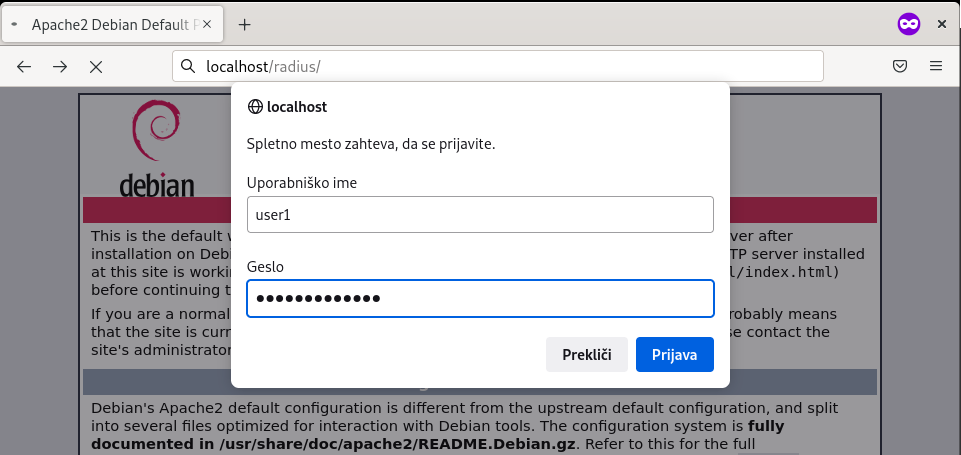
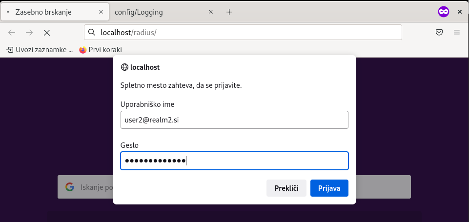

# 12. Lab: Managing networks with the RADIUS protocol

## Instructions

0. Use the network and virtual machines from the previous exercises.
1. Install the RADIUS server on the first virtual computer and check its operation.
2. Install apache2 on the first virtual machine and create some simple web page. Make sure that access to the website is restricted by username and password. Also make sure apache2 uses RADIUS for authentication.
3. Create your own authentication realm (RADIUS realm). Also create a RADIUS server with your own realm on second virtual machine and allow access to the website to users from that realm.

## More information

[Remote Authentication Dial-In User Service (RADIUS)](https://en.wikipedia.org/wiki/RADIUS) is a network protocol that provides centralized authentication, authorization and accounting (AAA) for users, which use network services.

[Authentication](https://en.wikipedia.org/wiki/Authentication) is the process of verifying the identity of an user.

[Authorization](https://en.wikipedia.org/wiki/Authorization) is the process of granting rights to a user to access a requested resource.

[Accounting](https://en.wikipedia.org/wiki/Audit_trail) is a log with records of operations on allocated resources.

## Detailed instructions

### 1. Task

On the first virtual computer, we install the `freeradius` implementation of the RADIUS protocol via the packet manager of our operating system.

    apt install freeradius

In the configuration file `clients.conf` of the `freeradius` program, we set the password for local access to the RADIUS server data.

    nano /etc/freeradius/3.0/clients.conf

    client localhost {
        secret = password1s	
    }

Create a new user in the `users` configuration file of the `freeradius` program.

    nano /etc/freeradius/3.0/users

    user1 Cleartext-Password := "user1password"
	    Reply-Message := "Welcome, %{User-Name}!"

In order for the new settings and the new user to be taken into account, we must restart the RADIUS server

    service freeradius restart

Now let's find out on which network port the RADIUS server is listening by installing the network monitoring tools `net-tools` or more specifically `netstat`.

    apt install net-tools

    netstat -n -l -p

We find that the RADIUS server is listening on network port 1812 and now we test the operation of the RADIUS server locally by running the `radtest` command.

    radtest user1 user1password localhost 1812 password1s

### 2. Task

We start by installing the Apache2 web server `apache2` and the RADIUS interception booklet `libapache2-mod-auth-radius` via our operating system's package manager.

    apt install apache2 libapache2-mod-auth-radius

In the configuration file `000-default.conf` we enable authentication with our local RADIUS server for files in the `/radius` folder and allow access only to registered RADIUS users.

    nano /etc/apache2/sites-available/000-default.conf

    AddRadiusAuth localhost:1812 password1s 5:3
    AddRadiusCookieValid 5

    <Location /radius/>
        AuthType Basic
        AuthName "RADIUS Authentication!"
        AuthBasicProvider radius
        AuthRadiusActive On
        require valid-user
    </Location>

Now create a new `radius` folder in the folder `/var/www/html` and create any HTML file in it. In order for the new settings to be taken into account, we need to restart the apache2 server.

    mkdir /var/www/html/radius

    cp /var/www/html/index.html /var/www/html/radius/

    nano /var/www/html/radius/index.html

    service freeradius restart

We test the operation of blocking by using a browser to try to access the address `http://localhost/radius`, where we must be asked to enter a username and password. When entering the username and password of the RADIUS user that we created in the previous step, we are granted access to the page, otherwise access is denied.

### 3. Task

On the second virtual machine, we also install the `freeradius` implementation of the RADIUS protocol through the package manager of our operating system.

    apt install freeradius

In the configuration file `clients.conf` of the `freeradius` program, we set the password for local access to the RADIUS server data.

    nano /etc/freeradius/3.0/clients.conf

    client localhost {
        secret = password2s	
    }

Create a new user in the `users` configuration file of the `freeradius` program.

    nano /etc/freeradius/3.0/users

    user2 Cleartext-Password := "user2password"
	    Reply-Message = "Welcome, %{User-Name}!"

In order for the new settings and the new user to be taken into account, we must restart the RADIUS server.

    service freeradius restart

Now let's test the operation of the RADIUS server locally by running the `radtest` command.

    radtest user2 user2password localhost 1812 password2s

So that the web page on the first virtual computer can also be accessed by the user `user2` from the RADIUS server on the second virtual computer, we also define a new realm on the second virtual computer in the `proxy.conf` file.

    nano /etc/freeradius/3.0/proxy.conf

    realm realm2.si {

    }

Now let's enable access to the local RADIUS server from the first virtual machine by adding it to the `clients.conf` file.

    nano /etc/freeradius/3.0/clients.conf

    client server1 {
        ipaddr = IP_OF_THE_FIRST_VM
        secret = server1p
    }

In order for the new settings to be taken into account, we must restart the RADIUS server.

    service freeradius restart

Now we return to the first virtual machine where we need to add the realm information on the second virtual machine to the `proxy.conf` file.

    nano /etc/freeradius/3.0/proxy.conf

    home_server server2 {
        ipaddr = IP_OF_THE_SECOND_VM
        secret = server1p
    }

    home_server_pool pool_server2 {
        type = fail-over
        home_server = server2
    }

    realm realm2.si {
        auth_pool = pool_server2
        nostrip
    }

In order for the new settings to be taken into account, we must restart the RADIUS server.

    service freeradius restart

First, let's test the operation with the `radtest` command and then via the browser, where user2 can successfully access the address `http://localhost/radius`.

    radtest user2@realm2.si user2password localhost 1812 password1s

In case of problems with the `freeradius` program, stop it and run it in the command line to get to the output of logs.

    service freeradius stop

    freeradius -X