# 13. Lab: Information management in the network

## Instructions

0. Use the network and virtual machines from the previous exercises.
1. Place the LDAP server on the first virtual machine.
2. Set up the web interface for managing the LDAP server.
3. Add two users to the LDAP server via the web interface.
4. Use the command line to query the LDAP server and list both users.
5. Through the web interface, enable users to make the settings necessary for logging into the operating system.
6. On the second virtual machine, use both users to log into the operating system.

## More information

[Lightweight Directory Access Protocol (LDAP)](https://en.wikipedia.org/wiki/Lightweight_Directory_Access_Protocol) is a protocol for accessing and managing distributed directory data over a network. It enables distributed storage of objects with multiple properties defined by schemas. It also defines the LDAP Data Interchange Format (LDIF) and the language for querying stored data.

[LDAP Data Interchange Format (LDIF) ](https://en.wikipedia.org/wiki/LDAP_Data_Interchange_Format) is a standard text format for exchanging and managing data stored in LDAP directories.

[Portable Operating System Interface (POSIX)](https://en.wikipedia.org/wiki/POSIX) represents a family of standards that ensure compatibility between operating systems. They define user and system programming interfaces and tools for ensuring compatibility, for example common presentation of users between several operating systems.

[Pluggable Authentication Module - PAM](https://en.wikipedia.org/wiki/Pluggable_authentication_module) is a mechanism that combines several low-level authentication processes into a high-level programming interface (API).

[Name Service Switch - NSS](https://en.wikipedia.org/wiki/Name_Service_Switch) connects computers with various sources of jointly configured databases and mechanisms for resolving names or users.

[NSLCD - LDAP Connection Daemon](https://linux.die.net/man/8/nslcd) local service for resolving LDAP names or users.

[NSCD - Name Service Cache Daemon](https://linux.die.net/man/8/nscd) a local service for caching the resolution of LDAP names or users.

[`ldapsearch`](https://linux.die.net/man/1/ldapsearch) is a tool that allows us to query the LDAP database.

[`getent`](https://linux.die.net/man/1/getent) command lists records from NSS libraries.

## Detailed instructions

### 1. Task

On the first virtual computer, we install the `slapd` LDAP server implementation and the `ldap-utils` tool for working with the LDAP server through the package manager of our operating system.

    apt install slapd ldap-utils

During the installation, choose an administrator password and press the `OK` button. Then enter the password again and press the `OK` button again.

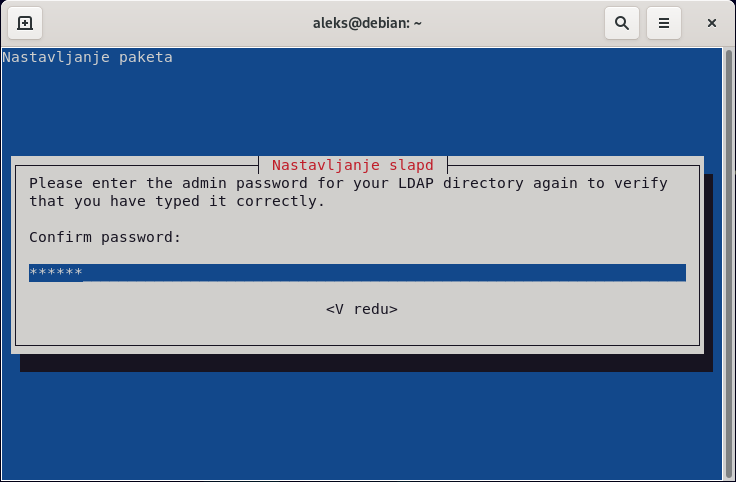

We can test the operation of the server with the command `ldapsearch`, which allows you to query the LDAP database. For example, we use simplified authentication with the `-x` flag, we choose anything as the starting base with the `-b` flag, we specify the database-level query method with the `-s` flag, and we want to print the `namingContexts` data field for all object classes.

    ldapsearch -x -b '' -s base '(objectclass=*)' namingContexts

    # extended LDIF
    #
    # LDAPv3
    # base <> with scope baseObject
    # filter: (objectclass=*)
    # requesting: namingContexts 
    #

    #
    dn:
    namingContexts: dc=nodomain

    # search result
    search: 2
    result: 0 Success

    # numResponses: 2
    # numEntries: 1

We find that we don't currently have any LDAP database created, so we create one by running the whole LDAP server setup process again.

    dpkg-reconfigure slapd

In the first step, we start the procedure for setting up the LDAP database by selecting the `No` button.

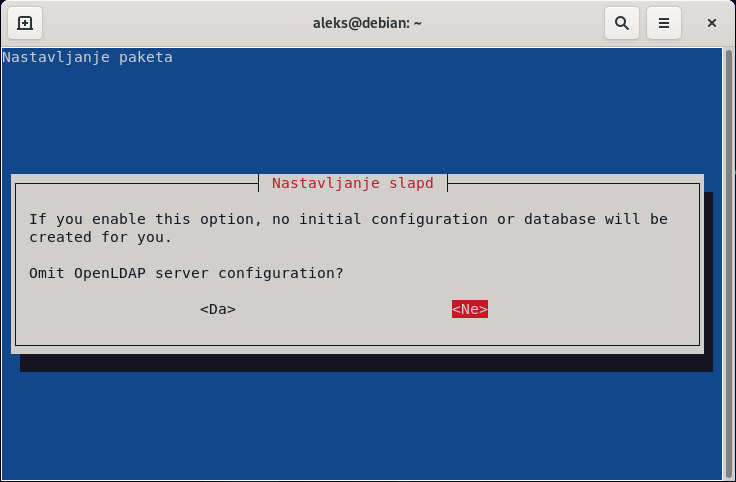

In the second step, we choose the domain of our LDAP database, for example `kpov.fri.uni-lj.si` and press the `OK` button.

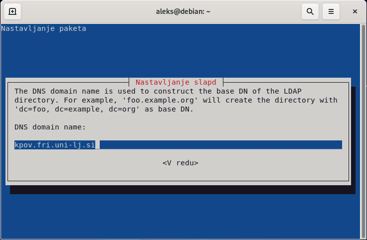

In the third step, we choose the name of our organization, for example `KPOV` and press the `OK` button.

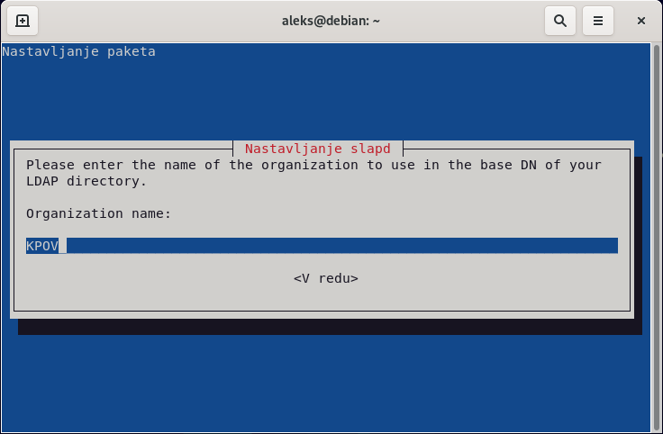

In the next step, choose a new administrator password and press the `OK` button. Then enter the password again and press the `OK` button again.

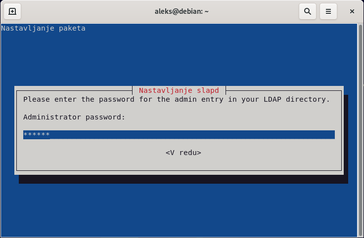

Next, confirm that when removing the `slapd` LDAP server, the LDAP database is also deleted by pressing the `Yes` button.

In the last step, we confirm the movement or deleting the settings of the previous LDAP databases by pressing the `Yes` button so that we can successfully set up a new LDAP database.

Now run the command `ldapsearch` again and check if there is now an LDAP database with our domain.

     ldapsearch -x -b '' -s base '(objectclass=*)' namingContexts

    # extended LDIF
    #
    # LDAPv3
    # base <> with scope baseObject
    # filter: (objectclass=*)
    # requesting: namingContexts 
    #

    #
    dn:
    namingContexts: dc=kpov,dc=fri,dc=uni-lj,dc=si

    # search result
    search: 2
    result: 0 Success

    # numResponses: 2
    # numEntries: 1

### 2. Task

Install any web interface for managing the LDAP server. For example [`FusionDirectory`](https://www.fusiondirectory.org/en/) which can be installed through our operating system's package manager. We also install the `apache2` web server, the `fusiondirectory-schema` data schema, and the user management plugin `fusiondirectory-plugin-posix`.
    
    apt install apache2 fusiondirectory fusiondirectory-schema fusiondirectory-plugin-posix

After successful installation, we continue the installation on the web address `http://localhost/fusiondirectory`. To start setting up the `FusionDirectory` program, we must run the echo command in the command line, which is displayed on the web page, and then press the `Next` button.

    echo -n gihvljjoonp3l1u8ti740jtbai > /var/cache/fusiondirectory/fusiondirectory.auth

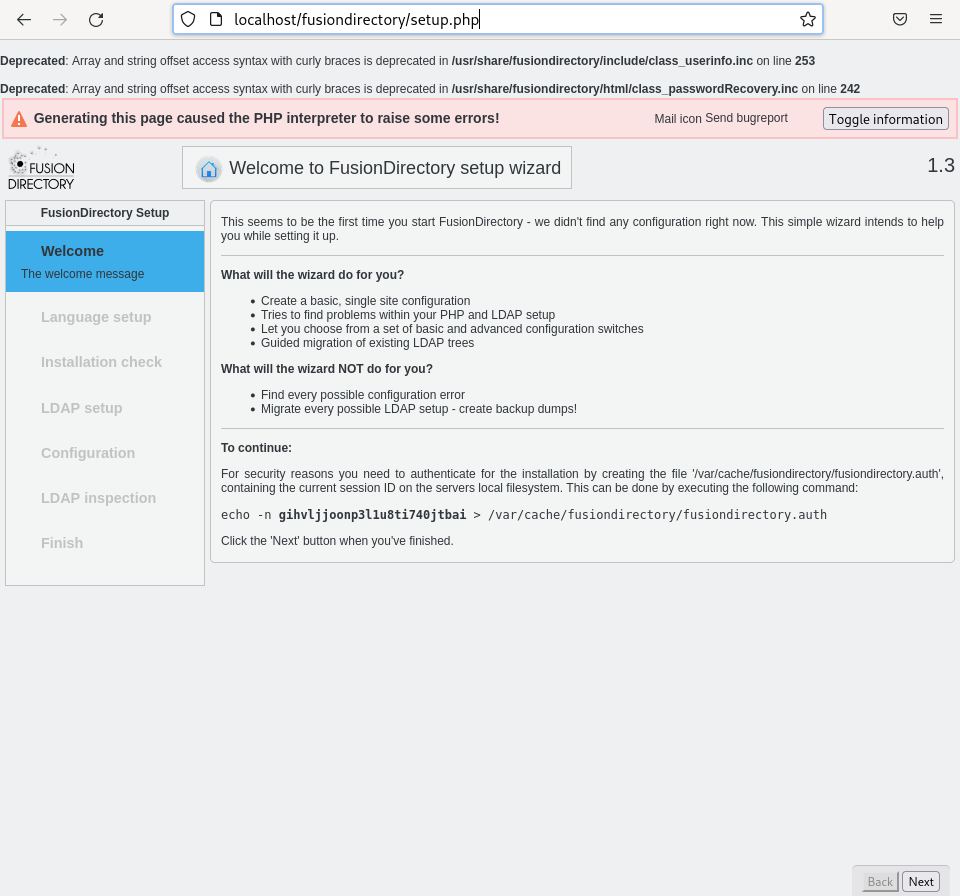

We choose the language we want to use during the setup, for example, we can leave it on the `Automatic` option and press the `Next` button.

Then check whether all plugins and environment variables are installed and correctly set, and press the `Next` button.

Now we enter the address of our LDAP server and enter the administrator password that we created during the installation. The correctness of the data for accessing the LDAP server can be checked by pressing the `Repeat` button. If the link check process returns us warnings and errors, then we need to add the schemas that `FusionDirectory` needs. After successfully establishing a connection with the LDAP server, press the `Next` button.

    fusiondirectory-insert-schema

    SASL/EXTERNAL authentication started
    SASL username: gidNumber=0+uidNumber=0,cn=peercred,cn=external,cn=auth
    SASL SSF: 0
    executing 'ldapadd -Y EXTERNAL -H ldapi:/// -f /etc/ldap/schema/fusiondirectory/core-fd.ldif'
    SASL/EXTERNAL authentication started
    SASL username: gidNumber=0+uidNumber=0,cn=peercred,cn=external,cn=auth
    SASL SSF: 0
    adding new entry "cn=core-fd,cn=schema,cn=config"

    SASL/EXTERNAL authentication started
    SASL username: gidNumber=0+uidNumber=0,cn=peercred,cn=external,cn=auth
    SASL SSF: 0
    executing 'ldapadd -Y EXTERNAL -H ldapi:/// -f /etc/ldap/schema/fusiondirectory/core-fd-conf.ldif'
    SASL/EXTERNAL authentication started
    SASL username: gidNumber=0+uidNumber=0,cn=peercred,cn=external,cn=auth
    SASL SSF: 0
    adding new entry "cn=core-fd-conf,cn=schema,cn=config"

    SASL/EXTERNAL authentication started
    SASL username: gidNumber=0+uidNumber=0,cn=peercred,cn=external,cn=auth
    SASL SSF: 0
    executing 'ldapadd -Y EXTERNAL -H ldapi:/// -f /etc/ldap/schema/fusiondirectory/ldapns.ldif'
    SASL/EXTERNAL authentication started
    SASL username: gidNumber=0+uidNumber=0,cn=peercred,cn=external,cn=auth
    SASL SSF: 0
    adding new entry "cn=ldapns,cn=schema,cn=config"

    SASL/EXTERNAL authentication started
    SASL username: gidNumber=0+uidNumber=0,cn=peercred,cn=external,cn=auth
    SASL SSF: 0
    executing 'ldapadd -Y EXTERNAL -H ldapi:/// -f /etc/ldap/schema/fusiondirectory/template-fd.ldif'
    SASL/EXTERNAL authentication started
    SASL username: gidNumber=0+uidNumber=0,cn=peercred,cn=external,cn=auth
    SASL SSF: 0
    adding new entry "cn=template-fd,cn=schema,cn=config"

On the next page, check the settings of the `FusionDirectory` program. We leave all settings at their default values, but we can correct, for example, the time zone, and then press the `Next` button.

Now let's set up PHP modules and plugins. The verification of the object classes and the root object failed, so we create them by pressing the `Migrate` button.

The window for creating new classes of objects and the root object and the proposed changes, which we implement by clicking the `Migrate` button.

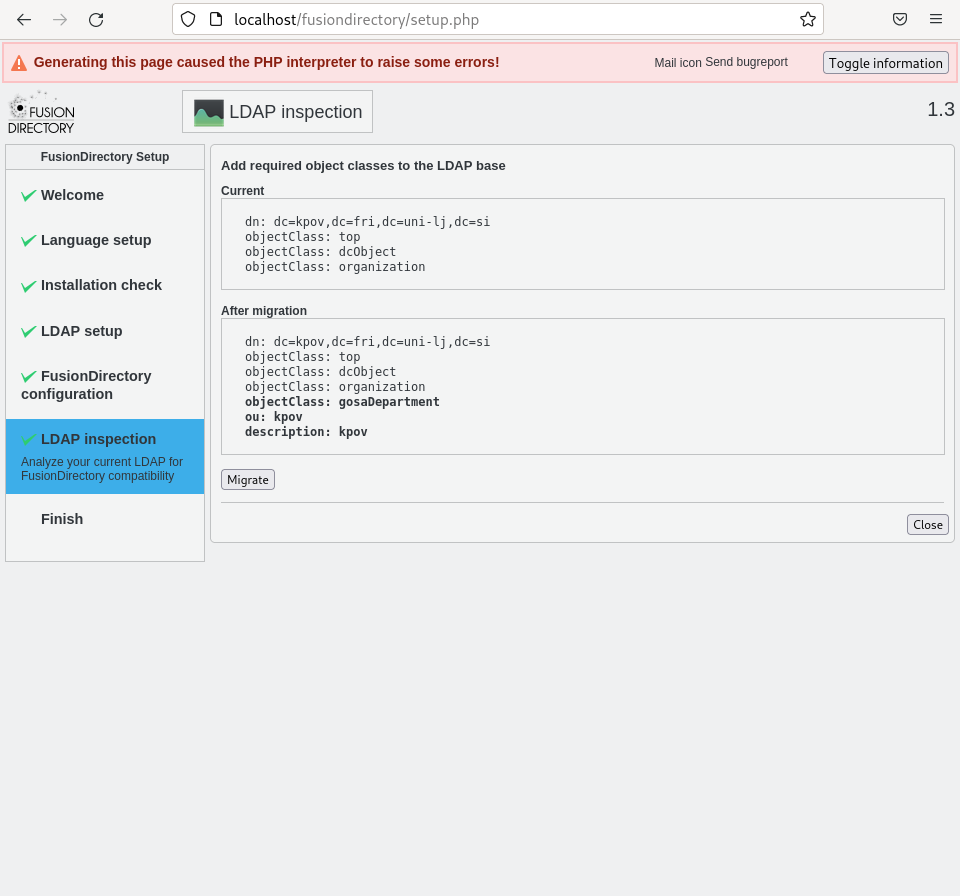

We see that we do not have an admin user created, so we create it by pressing the `Create` button. Enter any password for the administrator user twice in the `Password` and `Password (repeat)` fields and create the user by pressing the `Apply` button.

Also, we don't have any roles set and rolls for managing access. We add them by clicking the `Migrate` button. We have now eliminated all the missing requirements and run the entire test again by clicking the `Check again` button. When we have successfully finished setting up the PHP modules and plugins, click the `Next` button.

In the next step, we transfer the created configuration file via the browser to the local disk by clicking on the `Download configuration` button. We move the downloaded configuration file to the `/etc/fusiondirectory` folder and set the `fusiondirectory` program to start using it. To complete the setting, press the `Next` button.

    mv /home/aleks/Prejemi/fusiondirectory.conf /etc/fusiondirectory

    fusiondirectory-setup --check-config

    /etc/fusiondirectory/fusiondirectory.conf exists…
    /etc/fusiondirectory/fusiondirectory.conf is not set properly, do you want to fix it ?:  [Yes/No]?
    Yes

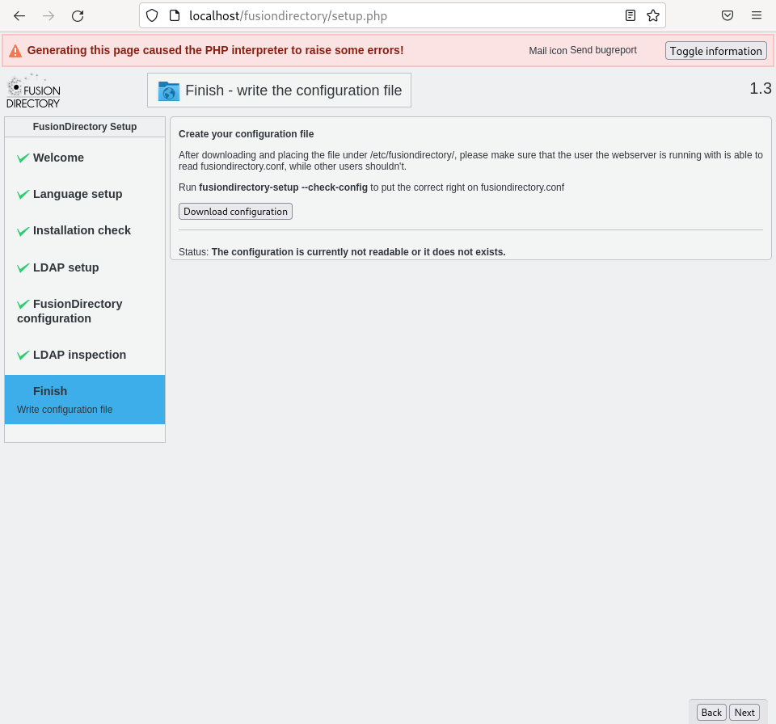

With the successful installation and setup of `FusionDirectory`, we can now access the application registration form at `http://localhost/fusiondirectory`. We log in with the default administrator `fd-admin` and the password we chose during installation.

### 3. Task

Now that we have successfully logged into the `FusionDirectory` application, we can create two new users in it. To add users, click on the `Users` icon or select `Users` from the side menu. Now, by clicking on the pull-down menu `Action` and then `Create` and `User`, we get to the form for creating users.

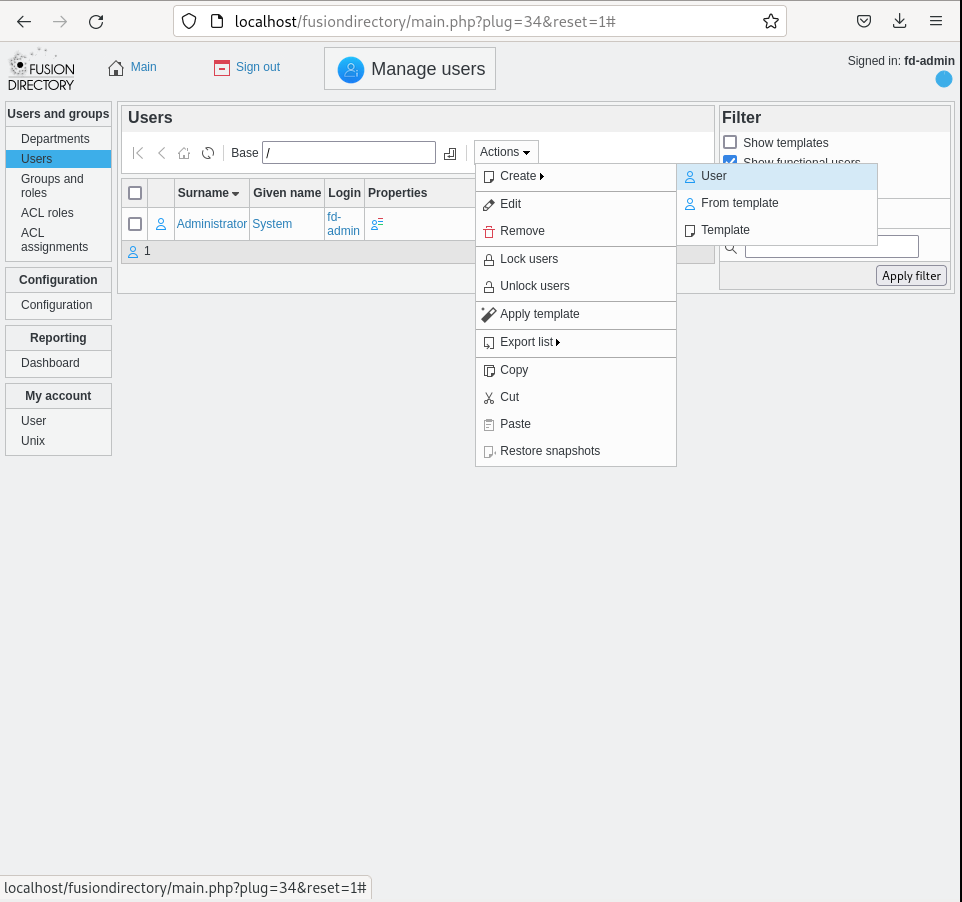

In order to create a user, we select `First name`, `Surname`, `Username` and `Password`, which we confirm by re-entering it. By clicking on the `OK` button, the user is created. Using this procedure we create two users.

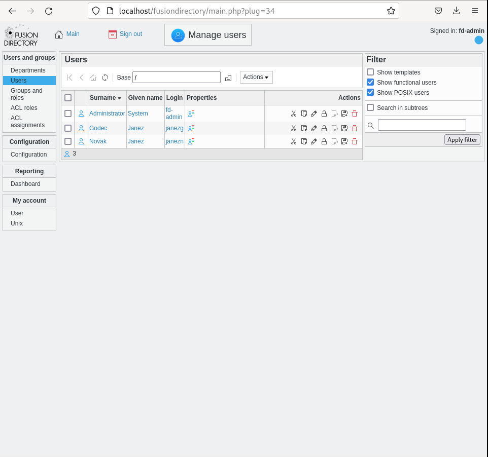

### 4. Task

Locally, the LDAP database can be queried using the `ldapsearch` tool via the command line. 

    ldapsearch -Y EXTERNAL -H ldapi:/// -b dc=kpov,dc=fri,dc=uni-lj,dc=si "givenName=Janez"

    SASL/EXTERNAL authentication started
    SASL username: gidNumber=0+uidNumber=0,cn=peercred,cn=external,cn=auth
    SASL SSF: 0
    # extended LDIF
    #
    # LDAPv3
    # base <dc=kpov,dc=fri,dc=uni-lj,dc=si> with scope subtree
    # filter: givenName=Janez
    # requesting: ALL
    #

    # janezg, people, kpov.fri.uni-lj.si
    dn: uid=janezg,ou=people,dc=kpov,dc=fri,dc=uni-lj,dc=si
    objectClass: inetOrgPerson
    objectClass: organizationalPerson
    objectClass: person
    cn: Janez Godec
    sn: Godec
    givenName: Janez
    uid: janezg

    # janezn, people, kpov.fri.uni-lj.si
    dn: uid=janezn,ou=people,dc=kpov,dc=fri,dc=uni-lj,dc=si
    objectClass: inetOrgPerson
    objectClass: organizationalPerson
    objectClass: person
    cn: Janez Novak
    sn: Novak
    givenName: Janez
    uid: janezn

    # search result
    search: 2
    result: 0 Success

    # numResponses: 3
    # numEntries: 2

    ldapsearch -Y EXTERNAL -H ldapi:/// -b dc=kpov,dc=fri,dc=uni-lj,dc=si "givenName=Ja*"

    SASL/EXTERNAL authentication started
    SASL username: gidNumber=0+uidNumber=0,cn=peercred,cn=external,cn=auth
    SASL SSF: 0
    # extended LDIF
    #
    # LDAPv3
    # base <dc=kpov,dc=fri,dc=uni-lj,dc=si> with scope subtree
    # filter: givenName=Janez
    # requesting: ALL
    #

    # janezg, people, kpov.fri.uni-lj.si
    dn: uid=janezg,ou=people,dc=kpov,dc=fri,dc=uni-lj,dc=si
    objectClass: inetOrgPerson
    objectClass: organizationalPerson
    objectClass: person
    cn: Janez Godec
    sn: Godec
    givenName: Janez
    uid: janezg

    # janezn, people, kpov.fri.uni-lj.si
    dn: uid=janezn,ou=people,dc=kpov,dc=fri,dc=uni-lj,dc=si
    objectClass: inetOrgPerson
    objectClass: organizationalPerson
    objectClass: person
    cn: Janez Novak
    sn: Novak
    givenName: Janez
    uid: janezn

    # search result
    search: 2
    result: 0 Success

    # numResponses: 3
    # numEntries: 2

    ldapsearch -Y EXTERNAL -H ldapi:/// -b dc=kpov,dc=fri,dc=uni-lj,dc=si "(&(givenName=Ja*)(uid=janezn))"

    SASL/EXTERNAL authentication started
    SASL username: gidNumber=0+uidNumber=0,cn=peercred,cn=external,cn=auth
    SASL SSF: 0
    # extended LDIF
    #
    # LDAPv3
    # base <dc=kpov,dc=fri,dc=uni-lj,dc=si> with scope subtree
    # filter: (&(givenName=Ja*)(uid=janezn))
    # requesting: ALL
    #

    # janezn, people, kpov.fri.uni-lj.si
    dn: uid=janezn,ou=people,dc=kpov,dc=fri,dc=uni-lj,dc=si
    objectClass: inetOrgPerson
    objectClass: organizationalPerson
    objectClass: person
    cn: Janez Novak
    sn: Novak
    givenName: Janez
    uid: janezn

    # search result
    search: 2
    result: 0 Success

    # numResponses: 2
    # numEntries: 1

We can also query the LDAP database from another virtual computer with the `ldapsearch` tool, which is installed with the `ldap-utils` package via the package manager of our operating system.

    ldapsearch -H ldap://SERVER_IP:389/ -D cn=admin,dc=kpov,dc=fri,dc=uni-lj,dc=si -b dc=kpov,dc=fri,dc=uni-lj,dc=si "(&(givenName=Ja*)(uid=janezn))" -W

    Enter LDAP Password: 
    # extended LDIF
    #
    # LDAPv3
    # base <dc=kpov,dc=fri,dc=uni-lj,dc=si> with scope subtree
    # filter: (&(givenName=Ja*)(uid=janezn))
    # requesting: ALL
    #

    # janezn, people, kpov.fri.uni-lj.si
    dn: uid=janezn,ou=people,dc=kpov,dc=fri,dc=uni-lj,dc=si
    objectClass: inetOrgPerson
    objectClass: organizationalPerson
    objectClass: person
    cn: Janez Novak
    sn: Novak
    givenName: Janez
    uid: janezn
    userPassword:: e1NTSEF9NEg0K2p6L3V2OVhlTVdkYVphOS9tNjNEdUNqdVIvLzQ=

    # search result
    search: 2
    result: 0 Success

    # numResponses: 2
    # numEntries: 1

### 5. Task

In the `FusionDirectory` on the `Users` page, click on an individual user and select the `Unix` tab, where we enable log into Unix operating systems by clicking on the `Add Unix settings` button.

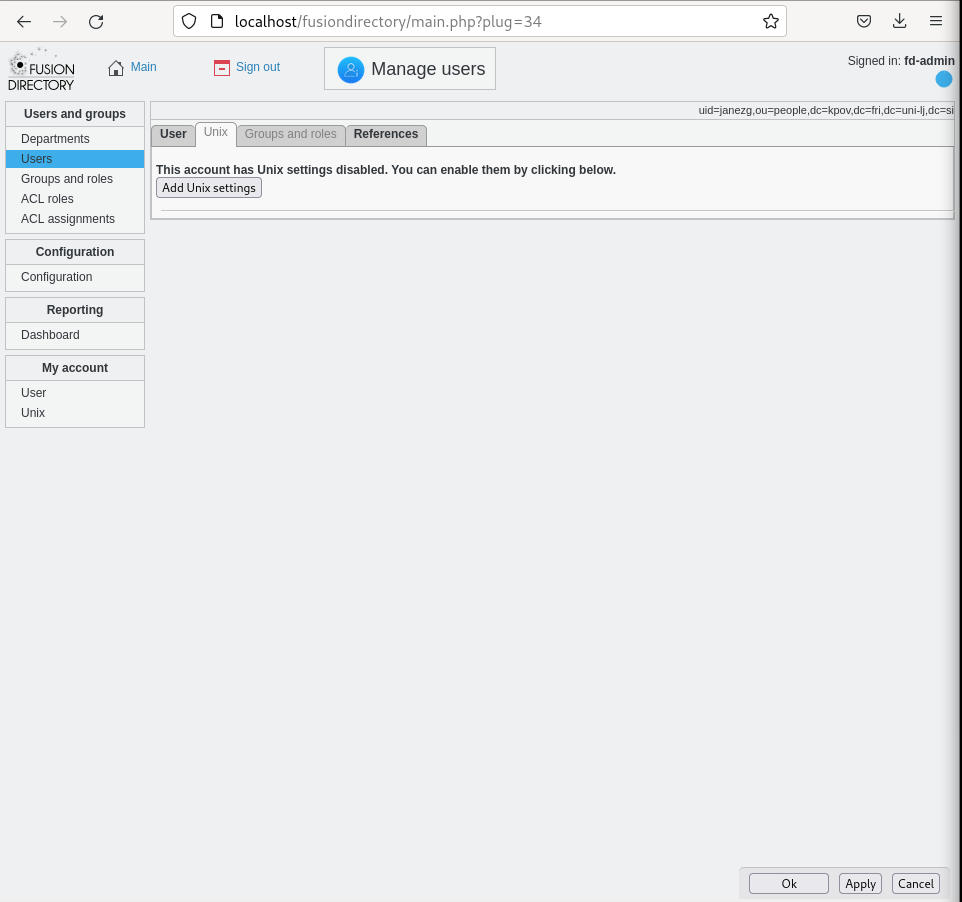

In the tab, specify the `Home Folder` and change the `Executing Shell` to `/bin/bash`. To confirm the changes, click on the `Confirm` button.

We do the same for the other user. On the `Users` page, there is now a penguin (Tux) icon next to users who are enabled to log into Unix operating systems.

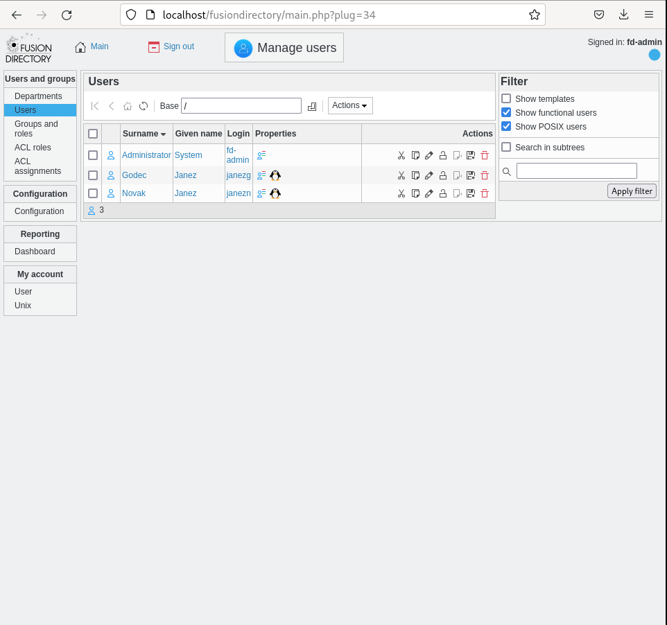

### 6. Task

On another virtual computer, we install the `libpam-ldapd` package, which takes care of user authentication (Pluggable Authentication Module - PAM) and `libnss-ldapd`, which takes care of the mapping between LDAP and operating system users (Name Service Switch - NSS).

    apt install libpam-ldapd libnss-ldapd

During the installation, we must specify the IP address of our first virtual computer on which the LDAP server is running and press the `OK` button.

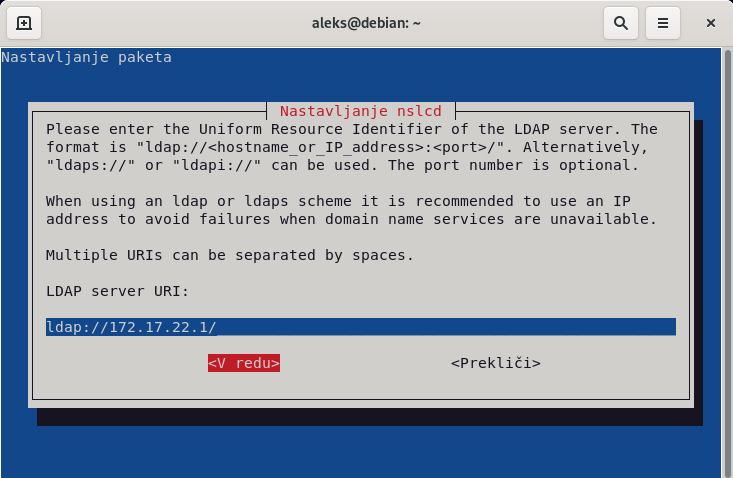

Then we enter the domain of our LDAP database, which is located on our LDAP server, and press the `OK` button.

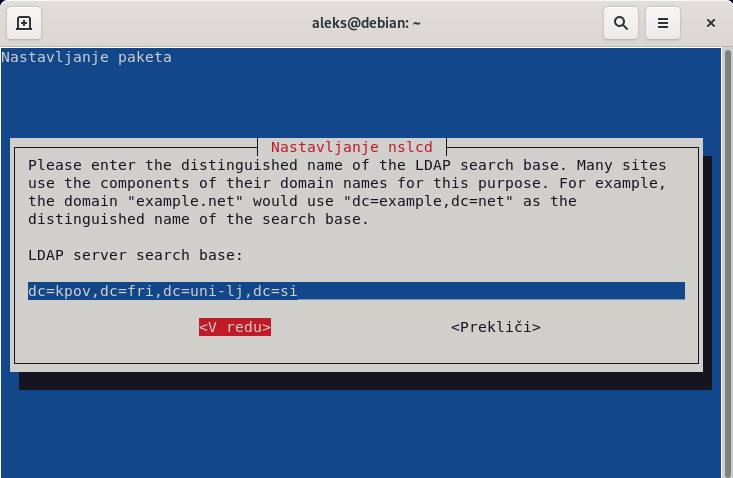

We select the `passwd` base of users, the `group` base of groups and the `shadow` base of passwords, which we will map to LDAP users.

Let's check if the LDAP users are already reachable as local users of the operating system with the command `getent`.

    getent passwd aleks

    aleks:x:1000:1000:Aleks,,,:/home/aleks:/bin/bash

    getent passwd janezn
    
    getent passwd janezg

We can see that LDAP users are not yet reachable as local users of the operating system, so we reconfigure the `nslcd` package (NSLCD - LDAP Connection Daemon), which is a local service for resolving LDAP names or users. Where we again enter the IP address of our first virtual computer on which the LDAP server is running and press the `OK` button.

     dpkg-reconfigure nslcd

Then we enter the domains of our LDAP database, which is located on our LDAP server, and press the `OK` button.

Now we choose not to use any LDAP authentication `none` and press the `OK` button.

We also choose not to encrypt the connection to our LDAP server by pressing the `No` button.

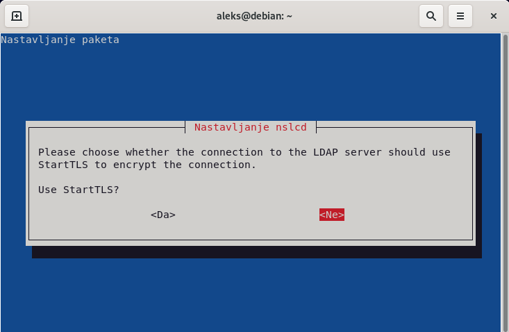

We run the package settings again, where we have to select the user base `passwd`, the group base `group` and the password base `shadow`.

    dpkg-reconfigure libnss-ldapd

Now we restart `nslcd` and `nscd` (NSCD - Name Service Cache Daemon), which performs caching for `nslcd`, and run the `getent` command again to check if our LDAP users are already reachable as local operating system users.

    service nslcd restart
    service nscd restart

    getent passwd janezg
    janezg:x:1101:1101:Janez Godec:/home/janezg:/bin/bash

    getent passwd janezn
    janezn:x:1102:1102:Janez Novak:/home/janezn:/bin/bash

Now enable authentication by running the `pam-auth-update` command and choosing to enable `Unix authentication`, `LDAP authentication`, `Register user sessions in the systemd control group...`, `Create home directory on login` and `GNOME  Keyring Deamon - Login keyring management` and press the `OK` button.

    pam-auth-update

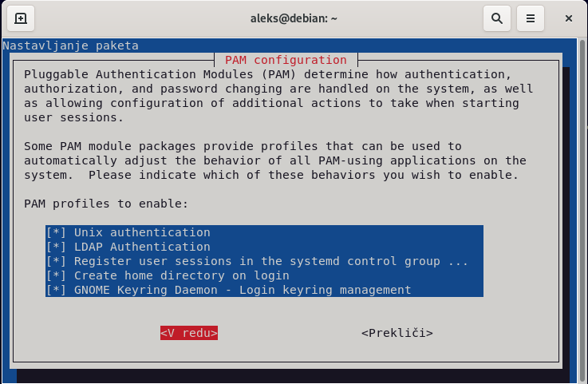

Now let's login with the LDAP user to our local operating system to test the operation, for example with `ls` and `su` commands.

    ls /home

    aleks

    su - janezg

    Creating directory '/home/janezg'.

    ls /home

    aleks janezg

    su - janezn

    Creating directory '/home/janezn'.

    ls /home

    aleks janezg janezn