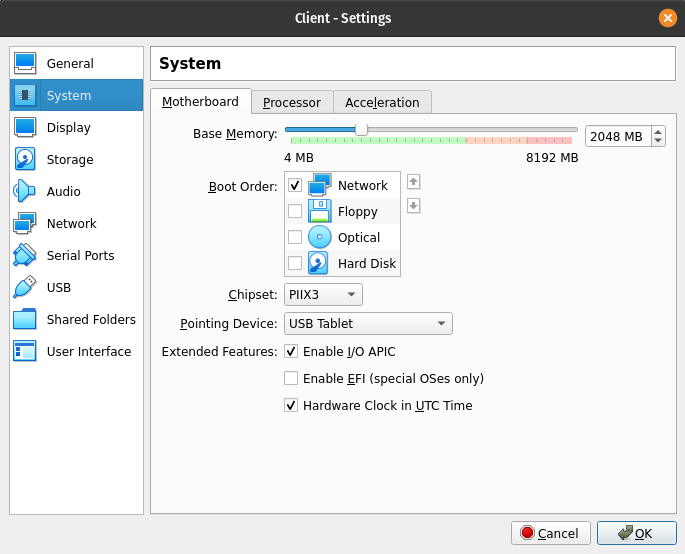
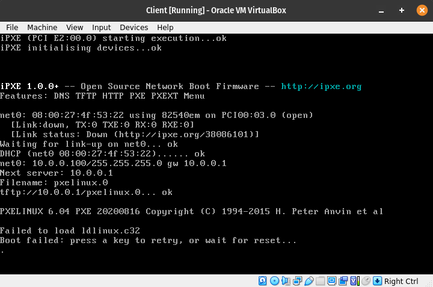
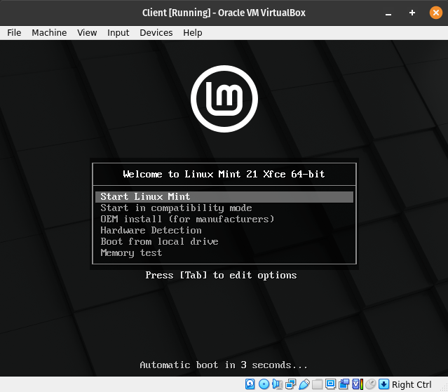

# 4. Lab: Running the bootloader over the network

## Instructions

0. Use the network and virtual machines from the previous labs.
1. Install or customize a DHCP server for running the bootloader over the network?
2. Install or customize a TFTP server for running the bootloader over the network?
3. Prepare the bootloader with the associated files in the folder served by the TFTP server.
4. Start the client virtual machine in network boot mode and have it acquire and run the bootloader over the network.

## Additional information

Booting a Linux operating system has the following steps:

1. When you press the computer's start button, the processor starts executing the code at a predetermined address, for example at 0xFFFF0 on the first Intel processors.
2. It starts executing commands stored in the [Basic Input Output System (BIOS)](https://en.wikipedia.org/wiki/BIOS) system located on a separate memory on the motherboard that detects and controls the hardware and hands over execution to the bootloader. A [Power-On Self-Test (POST)](https://en.wikipedia.org/wiki/Power-on_self-test) process is performed that detects and checks hardware such as processor, memory, graphics card, hard disks and other input/output devices.
3. Next, BIOS Extensions are run, which enables the execution of commands stored in the BIOS flash of expansion cards for their startup, for example network cards, disk controllers, graphics accelerators and other devices.
4. The BIOS reads the first 512B on the selected volume and starts it, it also provides the mentioned program with the possibility to access further data on the device. These first 512B on the volume are called [Master Boot Record (MBR)](https://en.wikipedia.org/wiki/Master_boot_record), which contains the bootloader in the first 446B, then the partition table in the next 64B and the signature in the last 2B . The MBR can be located on a hard drive, USB flash drive, CD or DVD.
6. [Bootloader](https://en.wikipedia.org/wiki/Bootloader) in the MBR takes care of starting the operating system. Since the system loader for a modern operating system needs more space than 446B, we split it into two parts. Stage 1 bootloader resides in the MBR and provides booting for stage 2 bootloader, which resides in one of the partitions on the data volume.
7. The 2 stage bootloader takes care of starting the operating system by starting the [kernel](https://en.wikipedia.org/wiki/Linux_kernel) with additional parameters and the [initial virtual disk (initial RAM disk - initrd or initramfs)](https://en.wikipedia.org/wiki/Initial_ramdisk) with a temporary initial file system.
8. Then the [first program (init)](https://en.wikipedia.org/wiki/Init) is run on the operating system that takes care of booting and gets the process ID of 1.
9. Now the user programs, graphic environment and other programs are able to start.

Common bootloaders:

- [GNU GRand Unified Bootloader (GRUB)](https://en.wikipedia.org/wiki/GNU_GRUB)
- [SYSLINUX](https://wiki.syslinux.org/wiki/index.php?title=SYSLINUX)
- [ISOLINUX](https://wiki.syslinux.org/wiki/index.php?title=ISOLINUX)
- [PXELINUX](https://wiki.syslinux.org/wiki/index.php?title=PXELINUX)
- [LILO](https://en.wikipedia.org/wiki/LILO_(bootloader))

The [`mount`](https://linux.die.net/man/8/mount) command allows us to mount a file system on a volume so that it can be accessed by our operating system.

## Detailed instructions

### 1. Task

We start the first virtual computer and check the status of both configured network cards with the `ip` command.

    ip a

    1: lo: <LOOPBACK,UP,LOWER_UP> mtu 65536 qdisc noqueue state UNKNOWN group default qlen 1000
        link/loopback 00:00:00:00:00:00 brd 00:00:00:00:00:00
        inet 127.0.0.1/8 scope host lo valid_lft forever preferred_lft forever
        inet6 ::1/128 scope host valid_lft forever preferred_lft forever
    2: enp0s3: <BROADCAST,MULTICAST,UP,LOWER_UP> mtu 1500 qdisc pfifo_fast state UP group default qlen 1000
        link/ether 08:00:27:26:d5:82 brd ff:ff:ff:ff:ff:ff
    3: enp0s8: <BROADCAST,MULTICAST,UP,LOWER_UP> mtu 1500 qdisc pfifo_fast state UP group default qlen 1000
        link/ether 08:00:27:86:d1:5b brd ff:ff:ff:ff:ff:ff
        inet6 fe80::a00:27ff:fe86:d15b/64 scope link noprefixroute valid_lft forever preferred_lft forever

We get the following printout, from which we determine that both network cards did not obtain IP network addresses, which is the result of missing settings and the operation of the `network-manager` program, which manages networks. To continue setting up the network, we will turn off the `network-manager` and prepare the necessary configuration files to achieve the desired operation.

    su -
    systemctl stop NetworkManager.service
    systemctl disable NetworkManager.service

We setup the network cards in the file `/etc/network/interfaces` in such a way that `enp0s3` represents the network card in the `NAT` network, which obtains the network address automatically via DHCP, and `enp0s8` represents the network card in the `Internal network` network, which has a static address because the DHCP server will work through it.

    nano /etc/network/interfaces

    auto enp0s3
    iface enp0s3 inet dhcp

    auto enp0s8
    iface enp0s8 inet static
      address 10.0.0.1
      netmask 255.255.255.0

In order for the settings to be taken into account, we restart the operation of the network cards on the virtual computer.

    systemctl restart networking.service

Now install a DHCP server, for example `isc-dhcp-server`.

    apt update
    apt install isc-dhcp-server

In the `/etc/default/isc-dhcp-server` file, set the network card on which the `isc-dhcp-server` DHCP server should run.

    nano /etc/default/isc-dhcp-server

    INTERFACESv4="enp0s8"

In the `/etc/dhcp/dhcpd.conf` file, we set which network will be managed by the DHCP server, i.e. which IP network addresses will it assign to network devices, the IP address of the main gateway, the [DNS](https://en.wikipedia.org/wiki/Domain_Name_System) server IP address (for example, the public Cloudflare DNS server with the IP address `1.1.1.1`), we set the name of the bootloader that we will offer over the network in the environment [Preboot Execution Environment (PXE) ](https://en.wikipedia.org/wiki/Preboot_Execution_Environment) and the server IP address that provides it.

    nano /etc/dhcp/dhcpd.conf
	
    subnet 10.0.0.0 netmask 255.255.255.0 {
	  range 10.0.0.100 10.0.0.200;
	  option routers 10.0.0.1;
	  option domain-name-servers 1.1.1.1;
      filename "pxelinux.0";
      next-server 10.0.0.1;
	}

Next, we enable routing in the `/etc/sysctl.conf` file.

    nano /etc/sysctl.conf

    net.ipv4.ip_forward=1

To take into account the changes in Linux kernel parameters, use the `sysctl` command.

    sysctl -p

Then we set the IP network address translation.

    iptables -t nat -A POSTROUTING -o enp0s3 -j MASQUERADE

Let's make sure that the rules we enter in `iptables` are preserved by installing `iptables-persistent` and saving them.

    apt install iptables-persistent

For the settings to take effect, restart the `isc-dhcp-server` DHCP server.

    systemctl restart isc-dhcp-server.service

### 2. Task

Let's install a TFTP server, for example `tftpd`.

    apt install tftpd

The installed `tftpd` server is already running with the default settings specified in the configuration file `/etc/inetd.conf`.

    nano /etc/inetd.conf

    tftp dgram udp wait nobody /usr/sbin/tcpd /usr/sbin/in.tftpd /srv/tftp

Let's create a `/srv/tftp` folder, which TFTP will offer over the network.

    mkdir /srv/tftp

### 3. Task

It we need a system bootloader that allows booting over the network. For example, let's use `pxelinux` by first obtaining it with a package manager and then moving it to `/srv/tftp` to make it accessible via TFTP on the network.

    apt install pxelinux
    cd /srv/tftp
    cp /usr/lib/PXELINUX/pxelinux.0 .

### 4. Task

We set the second virtual computer to boot over the network by clicking on the `Settings...` button in the menu above and under the tab `System\Motherboard` and the label `Start order:` select `Network` and uncheck all other options.

We now start the second virtual computer and it starts the PXE environment for booting over the network. The virtual machine successfully obtains an IP address from our DHCP server, receives the IP address of the TFTP server, and the name of the bootloader it needs to download. It then successfully downloads the `pxelinux.0` bootloader and runs it. The bootloader stops at the missing `ldlinux.c32` file.

Communication between the server and the client can also be tracked with logs that are updated automatically. First we see obtaining an IP address via the DHCP server, then via the TFTP protocol the download of the system loader `pxelinux.0` and then the search for the file `ldlinux.c32` in various places in the file system. Because the `ldlinux.c32` file does not exist, the network boot process fails.

    tail -f /var/log/syslog

    Nov  3 15:27:06 debian dhcpd[679]: DHCPDISCOVER from 08:00:27:4f:53:22 via enp0s8
    Nov  3 15:27:07 debian dhcpd[679]: DHCPOFFER on 10.0.0.100 to 08:00:27:4f:53:22 via enp0s8
    Nov  3 15:27:09 debian dhcpd[679]: reuse_lease: lease age 82 (secs) under 25% threshold, reply with unaltered, existing lease for 10.0.0.100
    Nov  3 15:27:09 debian dhcpd[679]: DHCPREQUEST for 10.0.0.100 (10.0.0.1) from 08:00:27:4f:53:22 via enp0s8
    Nov  3 15:27:09 debian dhcpd[679]: DHCPACK on 10.0.0.100 to 08:00:27:4f:53:22 via enp0s8
    Nov  3 15:27:09 debian in.tftpd[3304]: connect from 10.0.0.100 (10.0.0.100)
    Nov  3 15:27:09 debian tftpd[3305]: tftpd: trying to get file: pxelinux.0
    Nov  3 15:27:09 debian tftpd[3305]: tftpd: serving file from /srv/tftp
    Nov  3 15:27:09 debian in.tftpd[3306]: connect from 10.0.0.100 (10.0.0.100)
    Nov  3 15:27:09 debian tftpd[3307]: tftpd: trying to get file: ldlinux.c32
    Nov  3 15:27:09 debian tftpd[3307]: tftpd: serving file from /srv/tftp
    Nov  3 15:27:09 debian in.tftpd[3308]: connect from 10.0.0.100 (10.0.0.100)
    Nov  3 15:27:09 debian tftpd[3309]: tftpd: trying to get file: /boot/isolinux/ldlinux.c32
    Nov  3 15:27:09 debian in.tftpd[3310]: connect from 10.0.0.100 (10.0.0.100)
    Nov  3 15:27:09 debian tftpd[3311]: tftpd: trying to get file: /isolinux/ldlinux.c32
    Nov  3 15:27:09 debian in.tftpd[3312]: connect from 10.0.0.100 (10.0.0.100)
    Nov  3 15:27:09 debian tftpd[3313]: tftpd: trying to get file: /boot/syslinux/ldlinux.c32
    Nov  3 15:27:09 debian in.tftpd[3314]: connect from 10.0.0.100 (10.0.0.100)
    Nov  3 15:27:09 debian tftpd[3315]: tftpd: trying to get file: /syslinux/ldlinux.c32
    Nov  3 15:27:09 debian in.tftpd[3316]: connect from 10.0.0.100 (10.0.0.100)
    Nov  3 15:27:09 debian tftpd[3317]: tftpd: trying to get file: /ldlinux.c32

The missing file is part of the modules needed to run the bootloader, which also needs a configuration file. The easiest way to get to the files is to take the installation image of a Linux distribution that uses the `isolinux` bootloader and copy them to the `/srv/tftp` folder. Later, we will use the rest of the files to successfully boot the operating system. For example, we download the installation image of the distribution [Mint](https://linuxmint.com/download.php) and insert it into the first virtual machine by selecting it in the menu `Devices\Optical drives\Select disk file ...`. The image is now inserted and we access it via `/dev/sr0`, to access the files, we still have to mount it with the `mount` command in any empty folder.

    mount /dev/sr0 /mnt

Download the missing files from the `isolinux` folder on the attached installation image.

    cp /mnt/isolinux/ldlinux.c32 .
    cp /mnt/isolinux/libutil.c32 .
    cp /mnt/isolinux/vesamenu.c32 .
    cp /mnt/isolinux/libcom32.c32 .
    cp /mnt/isolinux/splash.png . 

We still lack the bootloader configuration file, for which we can use the `isolinux.cfg` file from the installation image. The `pxelinux` system loader can offer several configuration files at the same time, which are stored in the `pxelinux.cfg` folder, which we create and transfer the `isolinux.cfg` file to and rename it to `default`.

    mkdir pxelinux.cfg
    cp /mnt/isolinux/isolinux.cfg ./pxelinux.cfg/default

Now we restart the second virtual machine which successfully starts the bootloader with the given settings.

