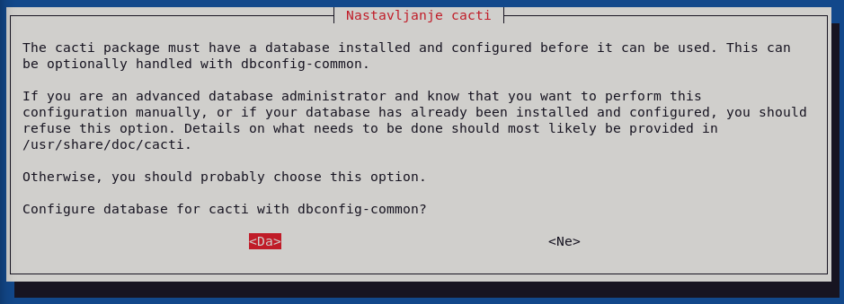
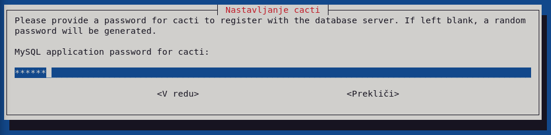
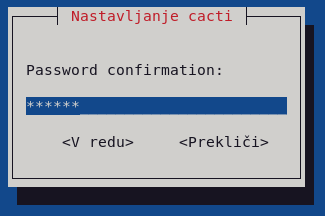
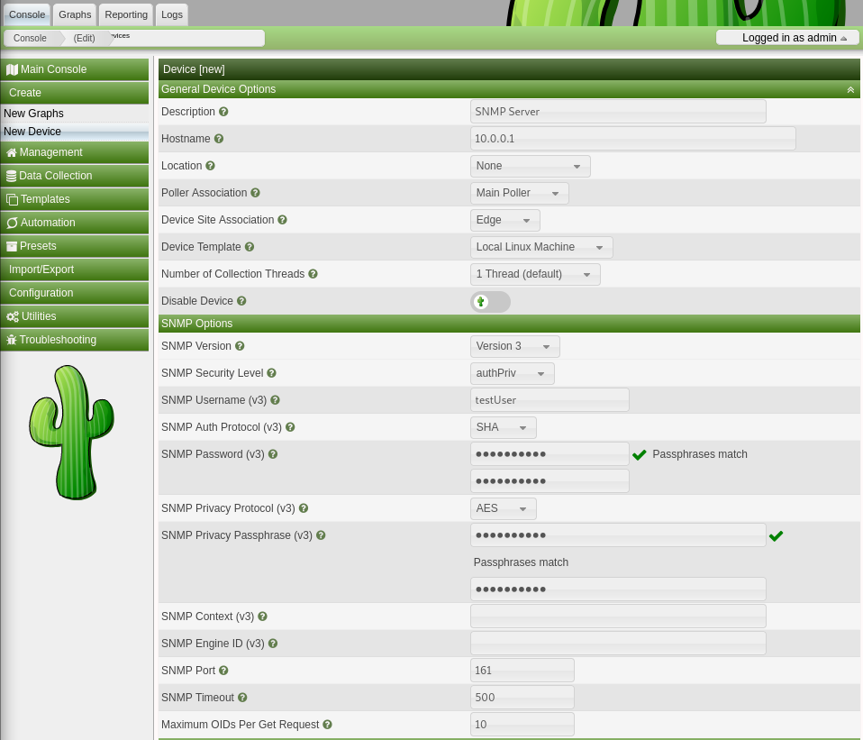
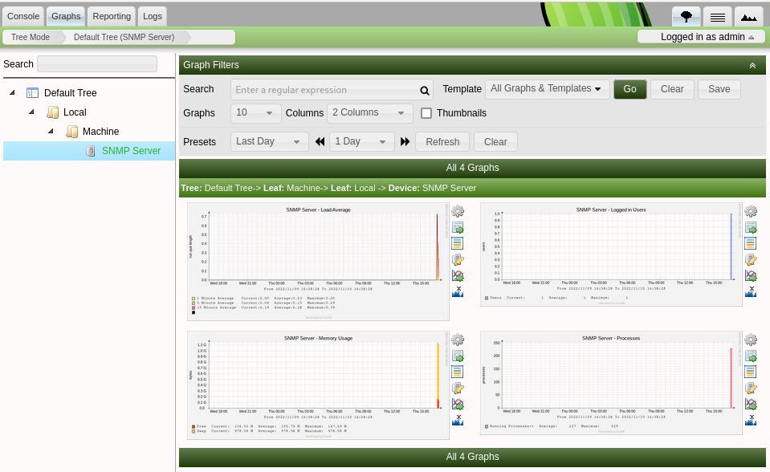

# 6. Lab: Network management

## Instructions

0. Use the network and virtual machines from the previous labs.
1. Set up a Simple Network Management Protocol (SNMP) server.
2. Get data from the SNMP server via the SNMPv1 protocol.
3. Make the received data readable.
4. Get data from the SNMP server via the SNMPv3 protocol.
5. Install a web application to collect SNMP data.

## Additional information

[Simple Network Management Protocol (SNMP)](https://en.wikipedia.org/wiki/Simple_Network_Management_Protocol) is a standard protocol for exchanging data over a network about the state of computers and the network.

SNMP uses the [Type Length Value (TLV)](https://en.wikipedia.org/wiki/Type-length-value) format for transmitting data.

To manage SNMP data, we use the [Management Information Base (MIB)](https://en.wikipedia.org/wiki/Management_information_base) database.

Commonly used web applications for collecting SNMP data:
- [ICINGA](https://icinga.com/)
- [Nagios](https://www.nagios.org/)
- [Zabbix](https://www.zabbix.com/)
- [Cacti](https://www.cacti.net)

## Detailed instructions

### 1. Task

Let's install the SNMP server on the first virtual computer, for example, `snmpd`, and the SNMP client to test the operation, for example, `snmp`.

    apt install snmpd snmp

### 2. Task

SNMP data is accessed with the `snmpwalk` command when we want to print out all available data and with the `snmpget` command when we want to access individual data. For example, we use `snmpwalk` and specify that we are using the protocol version `SNMPv1`, accessing the community `public` and accessing the SNMP server at the IP address `localhost`.

    snmpwalk -v 1 -c public localhost

In the SNMPv1 version of the protocol, communities allow us to define subgroups of data that can be accessed through them and edited in the configuration file `/etc/snmp/snmpd.conf`. Let's create a new community that gives us access to all the data stored by the SNMP server.

    nano /etc/snmp/snmpd.conf

    rocommunity community

For the settings to take effect, restart the `snmpd` SNMP server and test the operation with the `snmpwalk` command.

    systemctl restart snmpd.service

    snmpwalk -v 1 -c community localhost

In the configuration file `/etc/snmp/snmpd.conf` we also limit access to the SNMP server based on the IP addresses of the clients. In our case, we will enable access from all IP addresses.

    nano /etc/snmp/snmpd.conf

    agentaddress 0.0.0.0,[::1]

For the settings to take effect, restart the `snmpd` SNMP server and test the operation with the `snmpwalk` command from another virtual machine.

    systemctl restart snmpd.service

    snmpwalk -v 1 -c community 10.0.0.1

### 3. Task

The data is output in TLV format and we see that each data has its own hierarchically arranged Object Identifier (OID). Data output can be made more readable by using a MIB database that maps OIDs to descriptive identifiers. To install the MIB, we need to enable the additional non-open source repositories `non-free` and `contrib` in the package manager on both virtual machines, so that we can then install the databases on both of them.

    nano /etc/apt/sources.list

    deb http://deb.debian.org/debian/ bullseye main non-free contrib
    deb-src http://deb.debian.org/debian/ bullseye main non-free contrib

    apt update
    apt install snmp-mibs-downloader

Let's test the operation of the MIB database with the command `snmpwalk`.

    snmpwalk -m all -v 1 -c community localhost

### 4. Task

The main drawback of `SNMPv1` is that it does not support user authentication and does not encrypt the data sent. Version `SNMPv3` fixes these two shortcomings and also contains a bunch of other improvements. To access the data, we now need to create a user, so use the program already prepared in advance. For example, we set the user's access to read-only, authentication method and authentication password, and encryption method and encryption key.

    apt install libsnmp-dev

    systemctl stop snmpd.service

    net-snmp-create-v3-user -ro -a SHA -A kpovkaboom -x AES -X kpovkaboom testuser

We check in the configuration files `/var/lib/snmp/snmpd.conf` and `/usr/share/snmp/snmpd.conf` if the user has been created correctly and then restart the SNMP server and test the operation with the command `snmpwalk`.

    nano /var/lib/snmp/snmpd.conf

    createUser testuser SHA "kpovkaboom" AES "kpovkaboom"

    nano /etc/snmp/snmpd.conf

    rouser testuser

    systemctl restart snmpd.service

    nano /var/lib/snmp/snmpd.conf

    usmUser 1 3 0x80001f888082f37f51ace86c6300000000 "testuser" "testuser" NULL .1.3.6.1.6.3.10.1.1.3 0xeadfd1e83a80f141853375b1c4d7660b2be4d297 .1.3.6.1.6.3.10.1.2.4 0xeadfd1e83a80f141853375b1c4d7660b 0x

    snmpwalk -v 3 -m all -a SHA -A kpovkaboom -x AES -X kpovkaboom -l authPriv -u testuser 10.0.0.1

### 5. Task

Let's install a web application for obtaining data via the SNMP protocol, for example, `cacti`.

    apt install cacti

During the installation, we select that the web application `cacti` will use the web server `apache2` and press the `OK` button.

For data storage purposes, we use a database that we choose to automatically set to default settings by pressing the `Yes` button.

Then enter the password for the administrator account and press the `OK` button, and then confirm it by entering it again and pressing the `OK` button.

The web application is accessed via a browser.

    http://10.0.0.1/cacti

Log in to the web application with the username `admin` and the password we chose during installation.

To receive SNMP data, we need to add our server by selecting `Create\New Device` under the menu on the left and filling out the form to add a new device. For example, for `Description` we choose `SNMP Server`, for IP address `Hostname` we choose the IP address of our SNMP server `10.0.0.1`, for the version of SNMP protocol `SNMP Version` we choose version `Version 3`, for security level `SNMP Security Level` select `authPriv`, `SNMP Username (v3)` select the user we created earlier `testuser`, `SNMP Auth Protocol` select `SHA` and enter the authentication password under `SNMP Password (v3)`, for the encryption protocol `SNMP Privacy Protocol (v3)` select `AES-128` and enter the encryption key under `SNMP Privacy Passphrase` and leave all other settings at their default values. Confirm the form by pressing the `Create` button at the bottom right.

We now access the data via the tabs on the top left, for example, `Graphs`.

If we have a problem starting the `apache2` server, we check if port `80` is already in use with the `netstat` command and stop the process that uses it.

    apt install net-tools

    netstat -plnt

    Active Internet connections (only servers)
    Proto Recv-Q Send-Q Local Address           Foreign Address         State       PID/Program name    
    tcp        0      0 0.0.0.0:57161           0.0.0.0:*               LISTEN      635/rpc.mountd      
    tcp        0      0 127.0.0.1:3306          0.0.0.0:*               LISTEN      767/mariadbd        
    tcp        0      0 0.0.0.0:111             0.0.0.0:*               LISTEN      1/init              
    tcp        0      0 0.0.0.0:41681           0.0.0.0:*               LISTEN      635/rpc.mountd      
    tcp        0      0 127.0.0.1:631           0.0.0.0:*               LISTEN      618/cupsd           
    tcp        0      0 0.0.0.0:35931           0.0.0.0:*               LISTEN      635/rpc.mountd      
    tcp        0      0 0.0.0.0:33949           0.0.0.0:*               LISTEN      -                   
    tcp        0      0 0.0.0.0:2049            0.0.0.0:*               LISTEN      -                   
    tcp6       0      0 :::54603                :::*                    LISTEN      635/rpc.mountd      
    tcp6       0      0 :::47405                :::*                    LISTEN      635/rpc.mountd      
    tcp6       0      0 :::111                  :::*                    LISTEN      1/init              
    tcp6       0      0 :::80                   :::*                    LISTEN      957/apache2         
    tcp6       0      0 :::60819                :::*                    LISTEN      635/rpc.mountd      
    tcp6       0      0 :::46549                :::*                    LISTEN      -                   
    tcp6       0      0 ::1:631                 :::*                    LISTEN      618/cupsd           
    tcp6       0      0 :::2049                 :::*                    LISTEN      - 