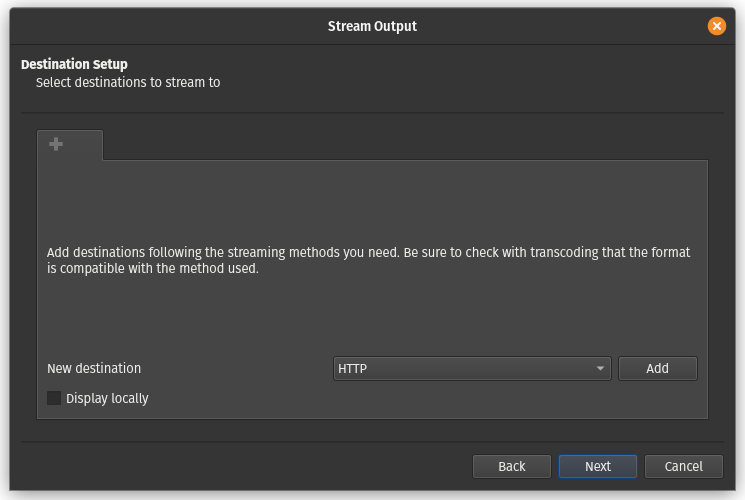
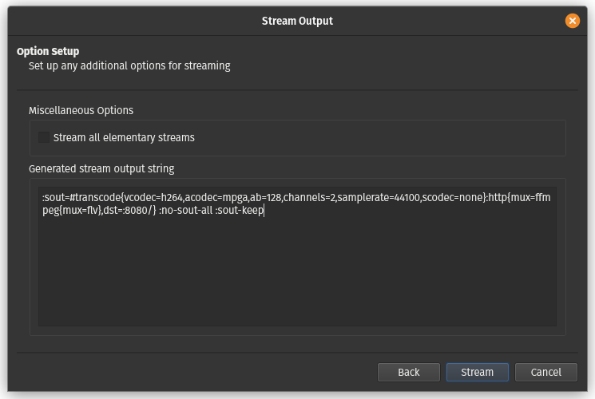
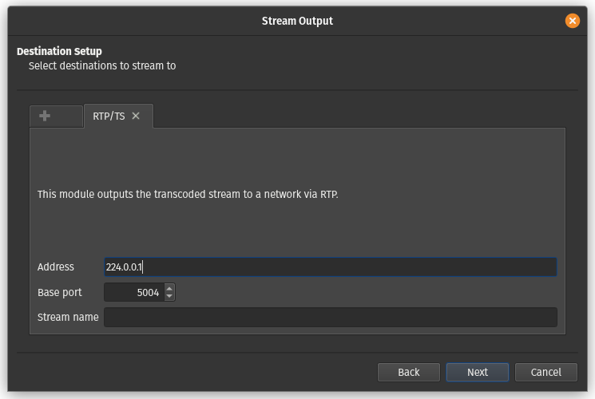
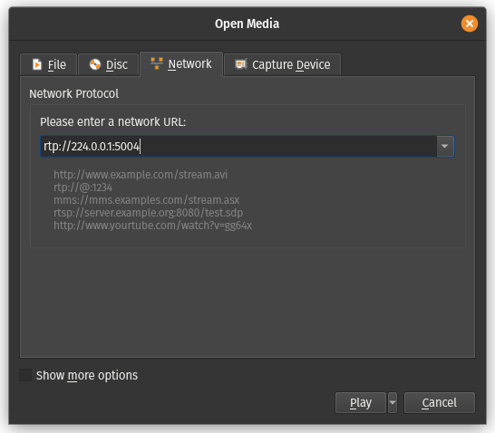

# 8. Lab: Streaming video content over the network

## Instructions

0. Use the network and virtual machines from the previous labs.
1. Safely download any video from YouTube.
2. Use VLC to stream video content via the HTTP protocol.
3. Use VLC to stream video content via a multicast address.

## Additional information

[YouTube](https://en.wikipedia.org/wiki/YouTube) is an online platform for sharing video content and also serves as a social network.

[youtube-dl](https://github.com/ytdl-org/youtube-dl/) original program for downloading video content from the YouTube web platform.

[yt-dlp](https://github.com/yt-dlp/yt-dlp) is a program that improves and extends `youtube-dl`.

[VLC](https://www.videolan.org/vlc/) is a program for playing audio and video files and streaming protocols.

[Hypertext Transfer Protocol - HTTP](https://en.wikipedia.org/wiki/Hypertext_Transfer_Protocol) is an application-layer protocol for sharing data on the Web. It was originally intended for publishing and receiving pages in [HyperText Markup Language - HTML](https://en.wikipedia.org/wiki/HTML) format.

[Uniform Resource Locator - URL](https://en.wikipedia.org/wiki/URL) predstavlja referenco spletni vir, ki določi njegovo lokacijo in način za njegovo pridobitev.

[Real-time Transport Protocol](https://en.wikipedia.org/wiki/Real-time_Transport_Protocol) is a network protocol for transmitting audio and video content over an IP network.

[Real Time Streaming Protocol](https://en.wikipedia.org/wiki/Real_Time_Streaming_Protocol) is an application layer network protocol that manages the transmission of multi-media content via an appropriate transport layer protocol.

[Multicast](https://en.wikipedia.org/wiki/Multicast) is a reference to a web resource that specifies its location on a computer network and a mechanism for retrieving it.

IP addresses designated for distribution:

| Network Block | Interval                    | No. of addresses |
|---------------|-----------------------------|------------------|
| 224.0.0.0/4   | 224.0.0.0 - 239.255.255.255 | 268435456        |

## Detailed instructions

### 1. Task

Let's install the `yt-dlp` program to download video content from the [YouTube](https://www.youtube.com/) web platform with `curl`.

    apt install curl

    sudo curl -L https://github.com/yt-dlp/yt-dlp/releases/latest/download/yt-dlp -o /usr/local/bin/yt-dlp
    
    sudo chmod a+rx /usr/local/bin/yt-dlp 

Now restart the terminal window. When we want to download a video, we can first check which formats are available for download.

    yt-dlp -F https://www.youtube.com/watch?v=aEvP2tqaZD4

    [youtube] aEvP2tqaZD4: Downloading webpage
    [youtube] aEvP2tqaZD4: Downloading android player API JSON
    [info] Available formats for aEvP2tqaZD4:
    ID  EXT   RESOLUTION FPS CH │  FILESIZE   TBR PROTO │ VCODEC        VBR ACODEC      ABR ASR MORE INFO
    ─────────────────────────────────────────────────────────────────────────────────────────────────────────────
    sb2 mhtml 48x27        1    │                 mhtml │ images                                storyboard
    sb1 mhtml 80x45        1    │                 mhtml │ images                                storyboard
    sb0 mhtml 160x90       1    │                 mhtml │ images                                storyboard
    139 m4a   audio only      2 │   1.10MiB   49k https │ audio only        mp4a.40.5   49k 22k low, m4a_dash
    249 webm  audio only      2 │   1.07MiB   48k https │ audio only        opus        48k 48k low, webm_dash
    250 webm  audio only      2 │   1.42MiB   63k https │ audio only        opus        63k 48k low, webm_dash
    140 m4a   audio only      2 │   2.91MiB  130k https │ audio only        mp4a.40.2  130k 44k medium, m4a_dash
    251 webm  audio only      2 │   2.82MiB  126k https │ audio only        opus       126k 48k medium, webm_dash
    17  3gp   176x144      6  1 │   1.74MiB   77k https │ mp4v.20.3     77k mp4a.40.2    0k 22k 144p
    160 mp4   256x144     25    │   1.56MiB   69k https │ avc1.4d400c   69k video only          144p, mp4_dash
    278 webm  256x144     25    │   1.91MiB   85k https │ vp9           85k video only          144p, webm_dash
    133 mp4   426x240     25    │   3.16MiB  141k https │ avc1.4d4015  141k video only          240p, mp4_dash
    242 webm  426x240     25    │   3.80MiB  169k https │ vp9          169k video only          240p, webm_dash
    134 mp4   640x360     25    │   8.59MiB  382k https │ avc1.4d401e  382k video only          360p, mp4_dash
    18  mp4   640x360     25  2 │ ~11.79MiB  511k https │ avc1.42001E  511k mp4a.40.2    0k 44k 360p
    243 webm  640x360     25    │   7.06MiB  314k https │ vp9          314k video only          360p, webm_dash
    135 mp4   854x480     25    │  16.80MiB  747k https │ avc1.4d401e  747k video only          480p, mp4_dash
    244 webm  854x480     25    │  12.68MiB  564k https │ vp9          564k video only          480p, webm_dash
    22  mp4   1280x720    25  2 │ ~35.90MiB 1556k https │ avc1.64001F 1556k mp4a.40.2    0k 44k 720p
    136 mp4   1280x720    25    │  32.09MiB 1427k https │ avc1.4d401f 1427k video only          720p, mp4_dash
    247 webm  1280x720    25    │  25.70MiB 1143k https │ vp9         1143k video only          720p, webm_dash
    137 mp4   1920x1080   25    │  56.80MiB 2526k https │ avc1.640028 2526k video only          1080p, mp4_dash
    248 webm  1920x1080   25    │  45.59MiB 2028k https │ vp9         2028k video only          1080p, webm_dash

Then we decide, for example, on the `22` option and transfer the video to the local disk.

    yt-dlp -f 22 https://www.youtube.com/watch?v=aEvP2tqaZD4

    [youtube] aEvP2tqaZD4: Downloading webpage
    [youtube] aEvP2tqaZD4: Downloading android player API JSON
    [info] aEvP2tqaZD4: Downloading 1 format(s): 22
    [download] Destination: Slovenian Impressions. Feel pure LOVE. [aEvP2tqaZD4].mp4
    [download] 100% of   34.99MiB in 00:00:04 at 7.70MiB/s

### 2. Task

Let's install the `VLC` program for playing and streaming video and audio content.

    apt install vlc

Streaming in the `VLC` program can be started via the graphical wizard, which can be started via the `Media\Stream...` menu. Under the `File` tab, by pressing the `Add` button, we select the file we want to stream and then continue by pressing the `Stream` button.

In the next step, we check the source for streaming, so that in the input field `Source:` is the path to the file we want to stream and in the input field `Type:` the type `file` is specified, and then we press the `Next` button.

Now we select the streaming protocol, for example, the `HTTP` protocol in the `New destination` dropdown menu and press the `Add` button.

In the next step, select the network port for the selected protocol by entering port `8080` in the `Port` drop-down menu and specifying the path or URL where our stream will be located, for example `/`. We press the `Next` button to continue.

The next step allows us to transcode the audio-video stream by selecting the `Activate Transcoding` option, and then in the `Profile` drop-down menu, we can choose the desired quality from the pre-defined profiles or, by clicking the key button, create our desired profile. We click on the `Next` button to continue.

When creating any profile for transcoding, we can choose from any supported protocols, which are classified according to their role in four tabs: encapsulation `Encapsulation`, video codec `Video codec`, audio codec `Audio codec` and subtitles `Subtitles`. We also enter the name of our profile in the `Profile name` input field and save it by clicking the `Save` button. We can now select it in the `Profile` drop-down menu.

In the last window, we get a setup output in the `Generated stream output string` field, if we wanted to run our current stream from the command shell with the `vlc` command. Press the `Stream` button to start streaming.

Let's test the streaming by opening another instance of the `VLC` player and opening the stream by going to the `Media\Open Network Stream ...` menu, entering the URL to our stream in the `Please enter a network URL:` field, for example, `http://localhost:8080` and then pressing the `Play` button to start playing the stream. Also try opening the stream on another virtual machine by opening the `VLC` player and opening the stream at the URL `http://10.0.0.1:8080`.

### 3. Task

Streaming in the `VLC` program can be started via the graphical wizard, which can be started via the `Media\Stream...` menu. Under the `File` tab, by pressing the `Add` button, we select the file we want to stream and then continue by pressing the `Stream` button.

In the next step, we check the source for streaming, so that in the input field `Source:` is the path to the file we want to stream and in the input field `Type:` the type `file` is specified, and then we press the `Next` button.

Now we select the streaming protocol, for example, the `RTP / MPEG Transport Stream` protocol in the `New destination` drop-down menu and press the `Add` button.

In the next step, we select the network port for the selected protocol, by entering the address for distribution on which the stream will be accessible in the `Address` input field, entering port `5004` in the `Port` drop-down menu and specifying the name of our stream in the `Stream name` input field, for example ` `. We press the button `Next` to continue.

The next step allows us to transcode the audio-video stream by selecting the `Activate Transcoding` option, and then in the `Profile` drop-down menu, we can choose the desired quality from the pre-defined profiles or, by clicking the key button, create our desired profile. We click on the button `Next` to continue.

When creating any profile for transcoding, we can choose from any supported protocols, which are classified according to their role in four tabs: encapsulation `Encapsulation`, video codec `Video codec`, audio codec `Audio codec` and subtitles `Subtitles`. We also enter the name of our profile in the `Profile name` input field and save it by clicking the `Save` button. We can now select it in the `Profile` drop-down menu.

In the last window, we get a setup output in the `Generated stream output string` field, if we wanted to run our current stream from the command shell with the `vlc` command. Press the `Stream` button to start streaming.

Let's test the streaming by opening another instance of the `VLC` player and opening the stream by going to the `Media\Open Network Stream ...` menu, entering the URL to our stream in the `Please enter a network URL:` field, for example, `rtp://224.0.0.1:5004` and then press the `Play` button to start playing the stream. Also try opening the stream on another virtual machine by opening the `VLC` player and opening the stream at the URL `rtp://224.0.0.1:5004`. If streaming is not working then the network does not support multicasting, you can fix this by setting both network adapters in both virtual machines that are currently set to `Internal Network` to `NAT Network`.

