# 13. Vaja: Upravljanje z informacijami v omrežju

## Navodila

0. Uporabite omrežje in navidezne računalnike iz prejšnjih vaj. 
1. Postavite strežnik LDAP na prvem navideznem računalniku.
2. Postavite spletni vmesnik za upravljanje z LDAP strežnikom.
3. Dodajte dva uporabnika v LDAP strežnik preko spletnega vmesnika.
4. Preko ukazne vrstice uporabite poizvedovanje po LDAP strežniku in izpišite oba uporabnika.
5. Preko spletnega vmesnika omogočite uporabnikoma nastavitve potrebne za vpisovanje v operacijski sistem.
6. Na drugem navideznem računalniku uporabite oba uporabnika za vpis v operacijski sistem.

## Dodatne informacije

[Lightweight Directory Access Protocol (LDAP)](https://en.wikipedia.org/wiki/Lightweight_Directory_Access_Protocol) je protokol za dostop in upravljanje z porazdeljenim imenikom podatkov preko omrežja. Omogoča porazdeljeno hrambo objektov z več lastnostmi, ki so definirane s shemami. Definira tudi format za izmenjavo podatkov LDAP Data Interchange Format (LDIF) ter jezik za poizvedovanje po shranjenih podatki.

[LDAP Data Interchange Format (LDIF) ](https://en.wikipedia.org/wiki/LDAP_Data_Interchange_Format) je standardni tekstovni format za izmenjavo in upravljanje podatkov shranjenih v imenikih LDAP.

[Portable Operating System Interface (POSIX)](https://en.wikipedia.org/wiki/POSIX) predstavlja družino standardov, ki skrbijo za kompatibilnost med operacijskimi sistemi. Definirajo uporabniške in sistemske programske vmesnike ter orodja za zagotavljanje kompatibilnosti, na primer skupna predstavitev uporabnikov med več operacijskimi sistemi.

[Pluggable Authentication Module - PAM](https://en.wikipedia.org/wiki/Pluggable_authentication_module) je mehanizem, ki združi več nizko nivojskih postopkov avtentikacije v visoko nivojski programski vmesnik (API). 

[Name Service Switch - NSS](https://en.wikipedia.org/wiki/Name_Service_Switch) povezujem računalnike z različnimi viri skupno nastavljenih podatkovnih baz in mehanizmov za razreševanje imen oziroma uporabnikov.

[NSLCD - LDAP Connection Daemon](https://linux.die.net/man/8/nslcd) lokalna storitev za razreševanje LDAP imen oziroma uporabnikov.

[NSCD - Name Service Cache Daemon](https://linux.die.net/man/8/nscd) lokalna storitev za predpomnenje razreševanja LDAP imen oziroma uporabnikov.

[`ldapsearch`](https://linux.die.net/man/1/ldapsearch) je orodje, ki nam omogoča poizvedovanje po bazi LDAP.

[`getent`](https://linux.die.net/man/1/getent) ukaz izpiše zapise z NSS knjižnic.

## Podrobna navodila

### 1. Naloga

Na prvem navideznem računalniku namestimo implementacijo LDAP strežnika `slapd` in orodje za delo z LDAP strežnikom `ldap-utils` preko upravljalca paketkov našega operacijskega sistema.

    apt install slapd ldap-utils

Med namestitvijo si izberemo skrbniško geslo in pritisnemo gumb `V redu`. Nato pa geslo ponovno vnesemo in spet pritisnemo gumb `V redu`.

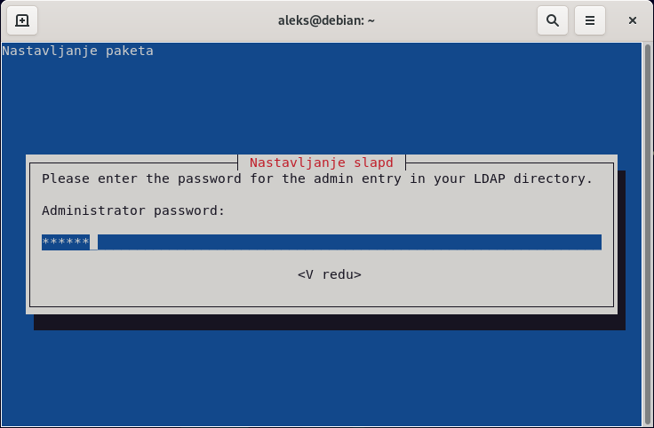

Delovanje strežnika lahko preizkusimo z ukazom `ldapsearch`, ki omogoča izvajanje poizvedb po bazi LDAP. Na primer, uporabimo poenostavljeno avtentikacijo z zastavico `-x`, za izhodiščno bazo izberemo karkoli z zastavico `-b`, določimo način poizvedovanja na nivo baze z zastavico `-s` in želimo izpisati podatkovno polje `namingContexts` za vse razrede objektov.

    ldapsearch -x -b '' -s base '(objectclass=*)' namingContexts

    # extended LDIF
    #
    # LDAPv3
    # base <> with scope baseObject
    # filter: (objectclass=*)
    # requesting: namingContexts 
    #

    #
    dn:
    namingContexts: dc=nodomain

    # search result
    search: 2
    result: 0 Success

    # numResponses: 2
    # numEntries: 1

Ugotovimo, da nimamo trenutno ustvarjene nobene baze LDAP, zato jo ustvarimo, tako da ponovno poženemo celoten postopek nastavitve LDAP strežnika.

    dpkg-reconfigure slapd

V prvem koraku poženemo postopek za vzpostavitev baze LDAP, tako da izberemo gumb `Ne`.

V drugem koraku si izberemo domeno naše baze LDAP, na primer `kpov.fri.uni-lj.si` in pritisnemo gumb `V redu`.

V tretjem koraku si izberemo ime naše organizacije, na primer `KPOV` in pritisnemo na gumb `V redu`.

V naslednjem koraku si izberemo novo skrbniško geslo in pritisnemo gumb `V redu`. Nato pa geslo ponovno vnesemo in spet pritisnemo gumb `V redu`.

Nato potrdimo, da se ob odstranitvi LDAP strežnika `slapd` pobriše tudi baza LDAP s pritiskom na gumb `Da`.

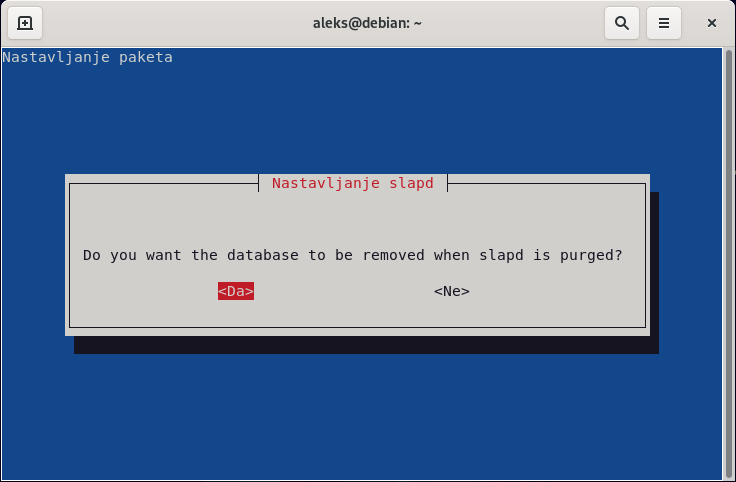

V zadnjem koraku še potrdimo premik oz. izbris nastavitev predhodnih baz LDAP s pritiskom na gumb `Da`, da lahko uspešno nastavimo novo bazo LDAP.

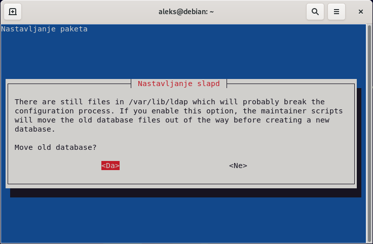

Sedaj ponovno poženemo ukaz `ldapsearch` in preverimo ali sedaj obstaja baza LDAP z našo domeno.

    ldapsearch -x -b '' -s base '(objectclass=*)' namingContexts

    # extended LDIF
    #
    # LDAPv3
    # base <> with scope baseObject
    # filter: (objectclass=*)
    # requesting: namingContexts 
    #

    #
    dn:
    namingContexts: dc=kpov,dc=fri,dc=uni-lj,dc=si

    # search result
    search: 2
    result: 0 Success

    # numResponses: 2
    # numEntries: 1

### 2. Naloga

Namestimo poljubni spletni vmesnik za upravljanje z LDAP strežnikom. Na primer [`FusionDirectory`](https://www.fusiondirectory.org/en/), ki ga lahko namestimo preko upravljalca paketkov našega operacijskega sistema. Prav tako namestimo spletni strežnik `apache2`, podatkovno shemo programa `fusiondirectory-schema` in vtičnik za upravljanje s uporabniki `fusiondirectory-plugin-posix`.

    apt install apache2 fusiondirectory fusiondirectory-schema fusiondirectory-plugin-posix

Po uspešni namestitvi nadaljujemo namestitev na spletnem naslovu `http://localhost/fusiondirectory`. Za pričetek nastavitve programa `FusionDirectory` moramo v ukazni vrstici pognati ukaz echo, ki je prikazan na spletni strani in nato pritisnemo na gumb `Naslednji`.

    echo -n gihvljjoonp3l1u8ti740jtbai > /var/cache/fusiondirectory/fusiondirectory.auth 

Izberemo jezik, ki ga želimo uporabiti med nastavitvijo, na primer lahko pustimo na možnosti `Samodejno` in pritisnemo na gumb `Naslednji`.

Nato preverimo ali imamo nameščene in pravilno nastavljene vse vtičnike in okoljske spremenljivke ter pritisnemo na gumb `Naslednji`.

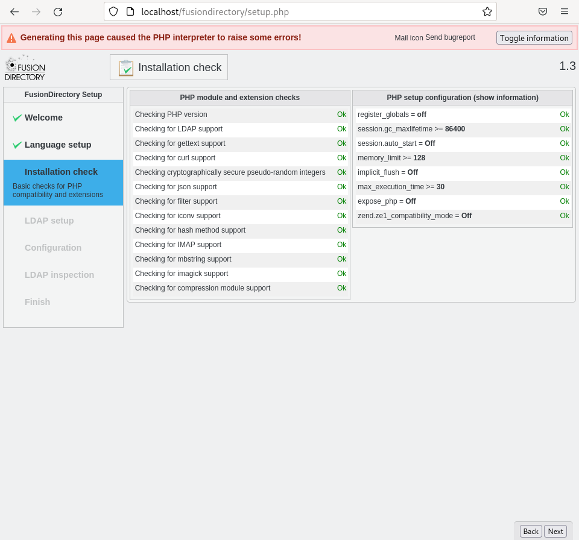

Sedaj vnesemo naslov našega LDAP strežnika in vpišemo skrbniško geslo, ki smo ga ustvarili med namestitvijo. Pravilnost podatkov za dostop do LDAP strežnika lahko preverimo s pritiskom na gumb pritisnemo na gumb `Ponovi`. Če nam postopek preverjanja povezave vrne opozorila in napake, potem moram dodati sheme, ki jih potrebuje `FusionDirectory`. Ko uspešno vzpostavimo povezavo z LDAP strežnikom, pritisnemo na gumb `Naslednji`.

    fusiondirectory-insert-schema

    SASL/EXTERNAL authentication started
    SASL username: gidNumber=0+uidNumber=0,cn=peercred,cn=external,cn=auth
    SASL SSF: 0
    executing 'ldapadd -Y EXTERNAL -H ldapi:/// -f /etc/ldap/schema/fusiondirectory/core-fd.ldif'
    SASL/EXTERNAL authentication started
    SASL username: gidNumber=0+uidNumber=0,cn=peercred,cn=external,cn=auth
    SASL SSF: 0
    adding new entry "cn=core-fd,cn=schema,cn=config"

    SASL/EXTERNAL authentication started
    SASL username: gidNumber=0+uidNumber=0,cn=peercred,cn=external,cn=auth
    SASL SSF: 0
    executing 'ldapadd -Y EXTERNAL -H ldapi:/// -f /etc/ldap/schema/fusiondirectory/core-fd-conf.ldif'
    SASL/EXTERNAL authentication started
    SASL username: gidNumber=0+uidNumber=0,cn=peercred,cn=external,cn=auth
    SASL SSF: 0
    adding new entry "cn=core-fd-conf,cn=schema,cn=config"

    SASL/EXTERNAL authentication started
    SASL username: gidNumber=0+uidNumber=0,cn=peercred,cn=external,cn=auth
    SASL SSF: 0
    executing 'ldapadd -Y EXTERNAL -H ldapi:/// -f /etc/ldap/schema/fusiondirectory/ldapns.ldif'
    SASL/EXTERNAL authentication started
    SASL username: gidNumber=0+uidNumber=0,cn=peercred,cn=external,cn=auth
    SASL SSF: 0
    adding new entry "cn=ldapns,cn=schema,cn=config"

    SASL/EXTERNAL authentication started
    SASL username: gidNumber=0+uidNumber=0,cn=peercred,cn=external,cn=auth
    SASL SSF: 0
    executing 'ldapadd -Y EXTERNAL -H ldapi:/// -f /etc/ldap/schema/fusiondirectory/template-fd.ldif'
    SASL/EXTERNAL authentication started
    SASL username: gidNumber=0+uidNumber=0,cn=peercred,cn=external,cn=auth
    SASL SSF: 0
    adding new entry "cn=template-fd,cn=schema,cn=config"

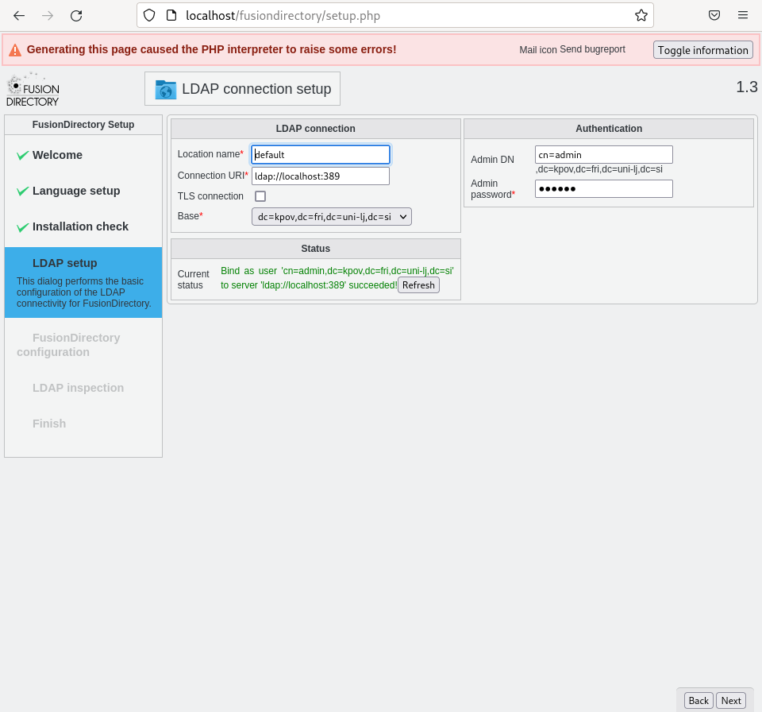

Na naslednji strani preverimo nastavitve programa `FusionDirectory`. Vse nastavitve pustimo na privzetih vrednostih, popravimo pa lahko na primer časovni pas, nato pa pritisnemo na gumb `Naslednji`.

Sedaj nastavimo še PHP module in vtičnike. Preverjanje razredov objektov in izhodiščnega objekta je spodletelo, zato jih ustvarimo s pritiskom na gumb `Prenesi`. 

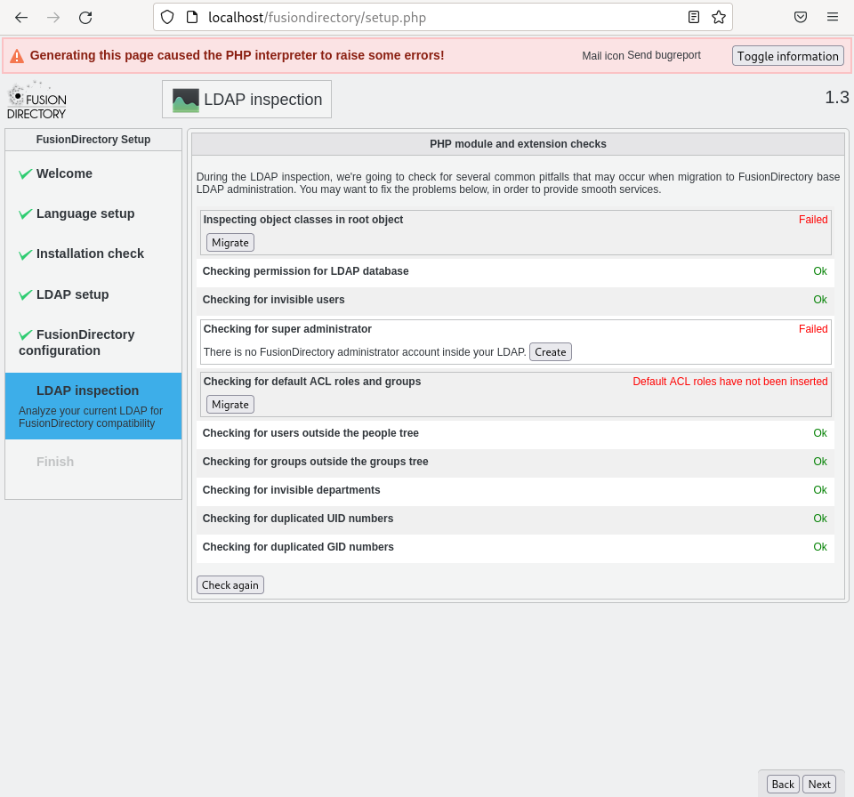

Okno za ustvarjanje novih razredov objektov in izhodiščnega objekta nam izpiše predlagane spremembe, ki jih izvedemo s klikom na gumb `Prenesi`.

Vidimo, da nimamo ustvarjenega skrbniškega uporabnika, zato ga ustvarimo s pritiskom na gumb `Ustvari`. Dvakrat vnesemo poljubno geslo za skrbniškega uporabnika v polji `Geslo` in `Geslo (ponovno)` in ustvarimo uporabnika s pritiskom na gumb `Uporabi`.

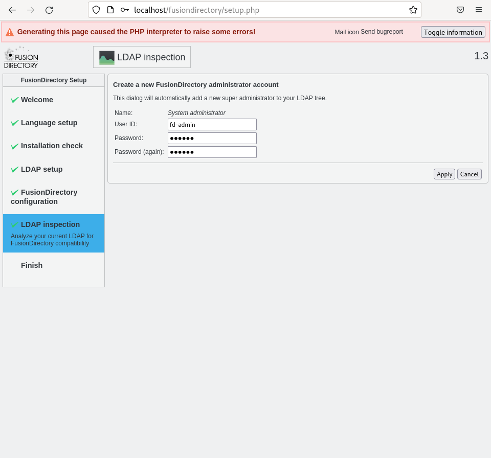

Prav tako nimamo postavljenih vlog in skup za upravljanje z dostopom. Dodamo jih s klikom na gumb `Prenesi`. Sedaj smo odpravili vse pomanjkljivosti in izvedemo celoten preizkus še enkrat s klikom na gumb `Preveri ponovno`. Ko uspešno zaključimo z nastavljanjem PHP modulov in vtičnikov, pritisnemo na gumb `Naslednji`.

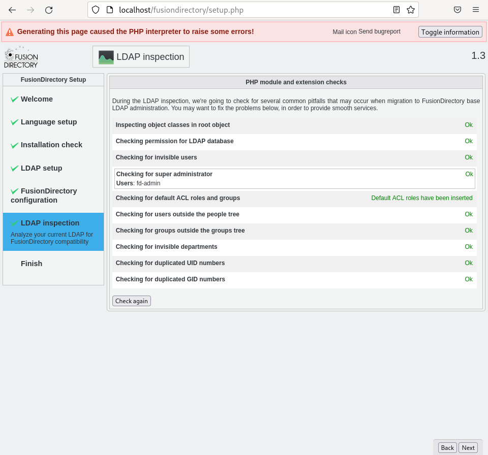

V naslednjem koraku prenesemo ustvarjeno nastavitveno datoteko preko brskalnika na lokalni disk s klikom na gumb `Prenesi konfiguracijo`. Preneseno nastavitveno datoteko prestavimo v mapo `/etc/fusiondirectory` in nastavimo, da jo program `fusiondirectory` začne uporabljati. Za zaključek nastavitve pritisnemo na gumb `Naslednji`.

    mv /home/aleks/Prejemi/fusiondirectory.conf /etc/fusiondirectory

    fusiondirectory-setup --check-config

    /etc/fusiondirectory/fusiondirectory.conf exists…
    /etc/fusiondirectory/fusiondirectory.conf is not set properly, do you want to fix it ?:  [Yes/No]?
    Yes

Ob uspešni namestitvi in nastavitvi `FusionDirectory` lahko sedaj na naslovu `http://localhost/fusiondirectory` dostopamo do obrazca za vpis v aplikacijo. Vpišemo se s privzetim skrbnikom `fd-admin` in geslom, ki smo ga izbrali med namestitvijo.

### 3. Naloga

Sedaj ko smo se uspešno vpisali v aplikacijo `FusionDirectory`, lahko v njej ustvarimo dva nova uporabnika. Za dodajanje uporabnikov kliknemo na ikono `Uporabniki` ali pa stranskem meniju izberemo možnost `Uporabniki`. Sedaj pa s klikom na izvlečni meni `Akcija` in nato `Ustvari` in `Uporabnik` pridemo do obrazca za ustvarjanje uporabnikov.

Da lahko uporabnika ustvarimo mi izberemo `Ime`, `Priimek`, `Uporabniško ime` ter `Geslo`, ki ga s ponovnim vnosom potrdimo. Ob kliku na gumb `V redu` uporabnika ustvarimo. Po tem postopku ustvarimo dva uporabnika.

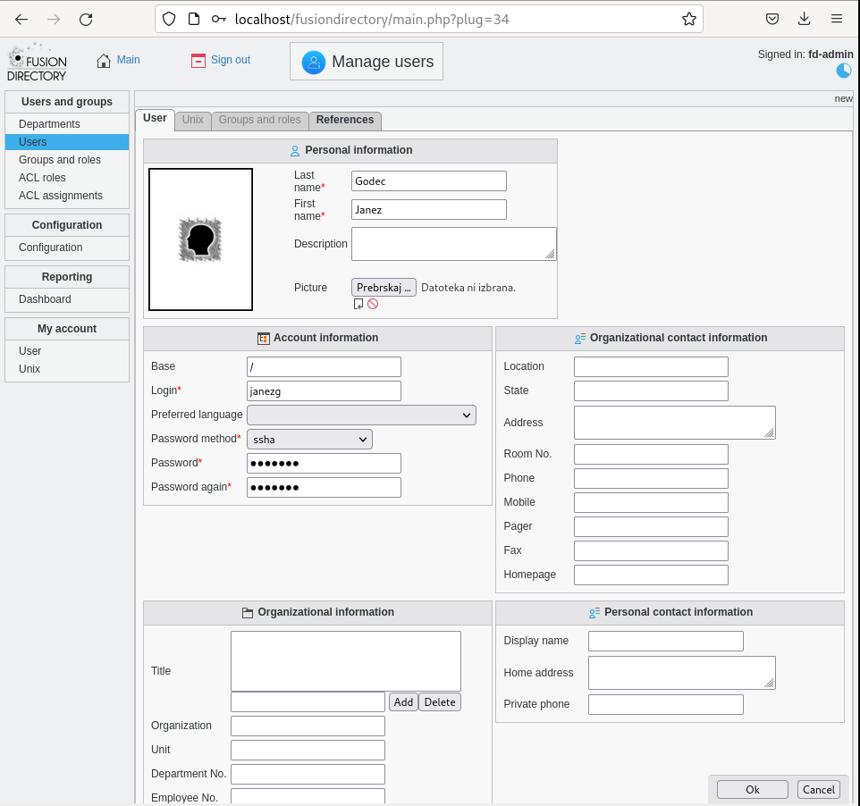

### 4. Naloga

Lokalno lahko preko ukazne vrstice poizvedujemo po bazi LDAP z orodjem `ldapsearch`.

    ldapsearch -Y EXTERNAL -H ldapi:/// -b dc=kpov,dc=fri,dc=uni-lj,dc=si "givenName=Janez"

    SASL/EXTERNAL authentication started
    SASL username: gidNumber=0+uidNumber=0,cn=peercred,cn=external,cn=auth
    SASL SSF: 0
    # extended LDIF
    #
    # LDAPv3
    # base <dc=kpov,dc=fri,dc=uni-lj,dc=si> with scope subtree
    # filter: givenName=Janez
    # requesting: ALL
    #

    # janezg, people, kpov.fri.uni-lj.si
    dn: uid=janezg,ou=people,dc=kpov,dc=fri,dc=uni-lj,dc=si
    objectClass: inetOrgPerson
    objectClass: organizationalPerson
    objectClass: person
    cn: Janez Godec
    sn: Godec
    givenName: Janez
    uid: janezg

    # janezn, people, kpov.fri.uni-lj.si
    dn: uid=janezn,ou=people,dc=kpov,dc=fri,dc=uni-lj,dc=si
    objectClass: inetOrgPerson
    objectClass: organizationalPerson
    objectClass: person
    cn: Janez Novak
    sn: Novak
    givenName: Janez
    uid: janezn

    # search result
    search: 2
    result: 0 Success

    # numResponses: 3
    # numEntries: 2

    ldapsearch -Y EXTERNAL -H ldapi:/// -b dc=kpov,dc=fri,dc=uni-lj,dc=si "givenName=Ja*"

    SASL/EXTERNAL authentication started
    SASL username: gidNumber=0+uidNumber=0,cn=peercred,cn=external,cn=auth
    SASL SSF: 0
    # extended LDIF
    #
    # LDAPv3
    # base <dc=kpov,dc=fri,dc=uni-lj,dc=si> with scope subtree
    # filter: givenName=Janez
    # requesting: ALL
    #

    # janezg, people, kpov.fri.uni-lj.si
    dn: uid=janezg,ou=people,dc=kpov,dc=fri,dc=uni-lj,dc=si
    objectClass: inetOrgPerson
    objectClass: organizationalPerson
    objectClass: person
    cn: Janez Godec
    sn: Godec
    givenName: Janez
    uid: janezg

    # janezn, people, kpov.fri.uni-lj.si
    dn: uid=janezn,ou=people,dc=kpov,dc=fri,dc=uni-lj,dc=si
    objectClass: inetOrgPerson
    objectClass: organizationalPerson
    objectClass: person
    cn: Janez Novak
    sn: Novak
    givenName: Janez
    uid: janezn

    # search result
    search: 2
    result: 0 Success

    # numResponses: 3
    # numEntries: 2

    ldapsearch -Y EXTERNAL -H ldapi:/// -b dc=kpov,dc=fri,dc=uni-lj,dc=si "(&(givenName=Ja*)(uid=janezn))"

    SASL/EXTERNAL authentication started
    SASL username: gidNumber=0+uidNumber=0,cn=peercred,cn=external,cn=auth
    SASL SSF: 0
    # extended LDIF
    #
    # LDAPv3
    # base <dc=kpov,dc=fri,dc=uni-lj,dc=si> with scope subtree
    # filter: (&(givenName=Ja*)(uid=janezn))
    # requesting: ALL
    #

    # janezn, people, kpov.fri.uni-lj.si
    dn: uid=janezn,ou=people,dc=kpov,dc=fri,dc=uni-lj,dc=si
    objectClass: inetOrgPerson
    objectClass: organizationalPerson
    objectClass: person
    cn: Janez Novak
    sn: Novak
    givenName: Janez
    uid: janezn

    # search result
    search: 2
    result: 0 Success

    # numResponses: 2
    # numEntries: 1

Prav tako pa lahko poizvedujemo po bazi LDAP tudi z drugega navideznega računalnika z orodjem `ldapsearch`, ki ga namestimo s paketom `ldap-utils` preko upravljalca paketov našega operacijskega sistema.

    ldapsearch -H ldap://SERVER_IP:389/ -D cn=admin,dc=kpov,dc=fri,dc=uni-lj,dc=si -b dc=kpov,dc=fri,dc=uni-lj,dc=si "(&(givenName=Ja*)(uid=janezn))" -W

    Enter LDAP Password: 
    # extended LDIF
    #
    # LDAPv3
    # base <dc=kpov,dc=fri,dc=uni-lj,dc=si> with scope subtree
    # filter: (&(givenName=Ja*)(uid=janezn))
    # requesting: ALL
    #

    # janezn, people, kpov.fri.uni-lj.si
    dn: uid=janezn,ou=people,dc=kpov,dc=fri,dc=uni-lj,dc=si
    objectClass: inetOrgPerson
    objectClass: organizationalPerson
    objectClass: person
    cn: Janez Novak
    sn: Novak
    givenName: Janez
    uid: janezn
    userPassword:: e1NTSEF9NEg0K2p6L3V2OVhlTVdkYVphOS9tNjNEdUNqdVIvLzQ=

    # search result
    search: 2
    result: 0 Success

    # numResponses: 2
    # numEntries: 1

### 5. Naloga

V `FusionDirectory` na strani `Uporabniki` kliknemo na posameznega uporabnika in izberemo zavihek `Unix` kjer omogočimo vpis v operacijske sisteme Unix, tako da kliknemo na gumb `Dodaj Unix nastavitve`.

V zavihku določimo `Domačo mapo` in spremenimo `Izvajalno lupino` na `/bin/bash`. Da potrdimo spremembe, kliknemo na gumb `Potrdi`.

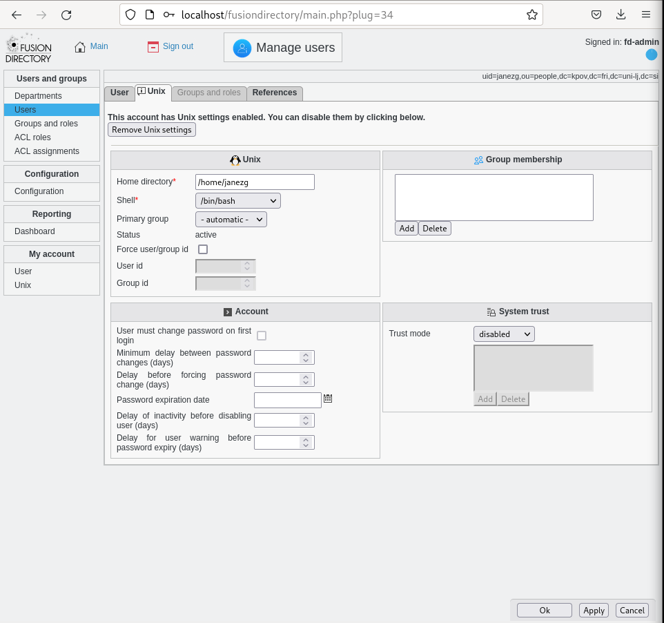

Enako naredimo tudi za drugega uporabnika. Na strani `Uporabniki` sedaj zraven uporabnikov, ki imajo omogočen vpis v operacijske sisteme Unix, ikono pingvina (Tux).

### 6. Naloga

Na drugem virtualnem računalniku namestimo paketka `libpam-ldapd`, ki skrbi za avtentikacijo uporabnikov (Pluggable Authentication Module - PAM) in `libnss-ldapd`, ki skrbi za preslikovanje med LDAP in uporabniki operacijskega sistema (Name Service Switch - NSS).

    apt install libpam-ldapd libnss-ldapd

Med namestitvijo moramo podati IP naslov našega prvega virtualnega računalnika, na katerem teče LDAP strežnik in pritisnemo na gumb `V redu`.

Nato vnesemo še domene naše baze LDAP, ki se nahaja na našem LDAP strežniku in pritisnemo na gumb `V redu`.

Izberemo bazo uporabnikov `passwd`, bazo skupin `group` in bazo gesel `shadow`, ki jih bomo preslikovali za LDAP uporabnike.

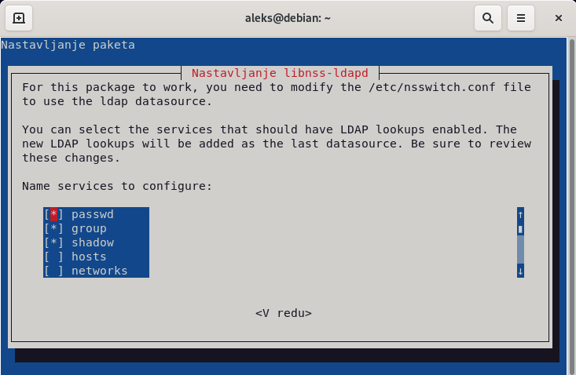

Preverimo ali so LDAP uporabniki že dosegljivi kot lokalni uporabniki operacijskega sistema z ukazom `getent`.

    getent passwd aleks

    aleks:x:1000:1000:Aleks,,,:/home/aleks:/bin/bash

    getent passwd janezn
    
    getent passwd janezg

Vidimo, da LDAP uporabniki še niso dosegljivi kot lokalni uporabniki operacijskega sistem zato požene ponovno nastavitev paketa `nslcd` (NSLCD - LDAP Connection Daemon), ki je lokalna storitev za razrešavanje LDAP imen oziroma uporabnikov. Kjer ponovno vnesemo IP naslov našega prvega virtualnega računalnika, na katerem teče LDAP strežnik in pritisnemo na gumb `V redu`.

    dpkg-reconfigure nslcd

Nato vnesemo še domene naše baze LDAP, ki se nahaja na našem LDAP strežniku in pritisnemo na gumb `V redu`.

Sedaj pa izberemo, da ne bomo uporabljali nobene LDAP avtentikacije `none` in pritisnemo na gumb `V redu`.

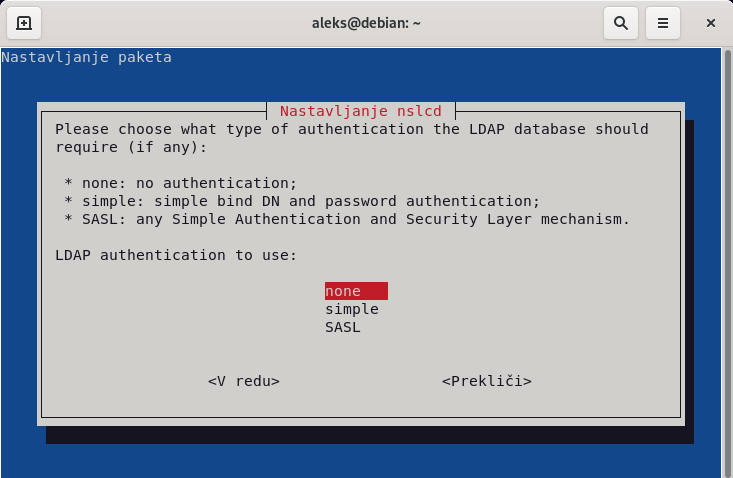

Prav tako izberemo, da ne bomo šifrirali poveza do našega LDAP strežnika, tako da pritisnemo na gumb `Ne`.

Ponovno poženemo še nastavitev paketa, kjer moramo izbrati bazo uporabnikov `passwd`, bazo skupin `group` in bazo gesel `shadow`.

    dpkg-reconfigure libnss-ldapd

Sedaj ponovno zaženemo `nslcd` in `nscd` (NSCD - Name Service Cache Daemon), ki izvaja predpomnenje za `nslcd` ter ponovno poženemo ukaz `getent`, da preverimo ali do naši LDAP uporabniki že dosegljivi kot lokalni uporabniki operacijskega sistema.

    service nslcd restart
    service nscd restart

    getent passwd janezg
    janezg:x:1101:1101:Janez Godec:/home/janezg:/bin/bash

    getent passwd janezn
    janezn:x:1102:1102:Janez Novak:/home/janezn:/bin/bash

Sedaj pa omogočimo še avtentikacijo, tako da poženemo ukaz `pam-auth-update` in izberemo, da omogočimo `Unix avtentikacijo`, `LDAP avtentikacijo`, `Registiramo uporabniško sejo v systemd kontrolno skupino...`, `Ustvarimo domači imenik ob vpisu` in `GNOME storitev za upravljanje s ključi za vpis` ter pritisnemo na gumb `V redu`.

    pam-auth-update

Sedaj se vpišemo z LDAP uporabnikoma v naš lokalni operacijski sistem, da preverimo delovanje, na primer z ukazoma `ls` in `su`.

    ls /home

    aleks

    su - janezg

    Creating directory '/home/janezg'.

    ls /home

    aleks janezg

    su - janezn

    Creating directory '/home/janezn'.

    ls /home

    aleks janezg janezn
