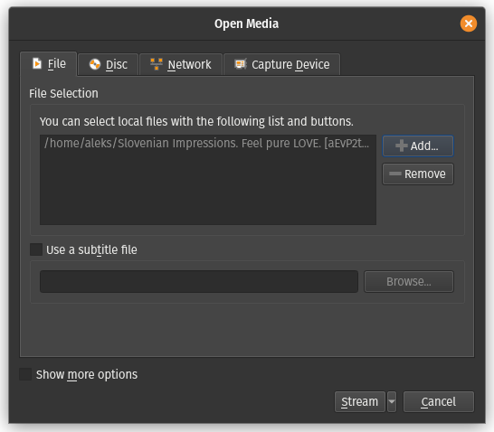
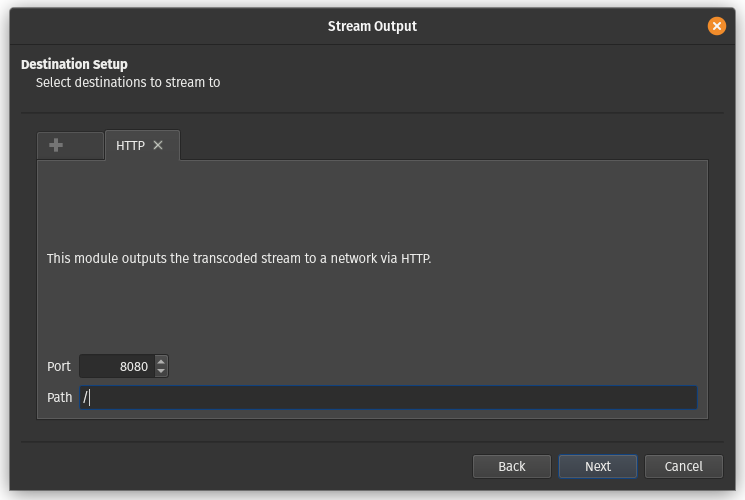
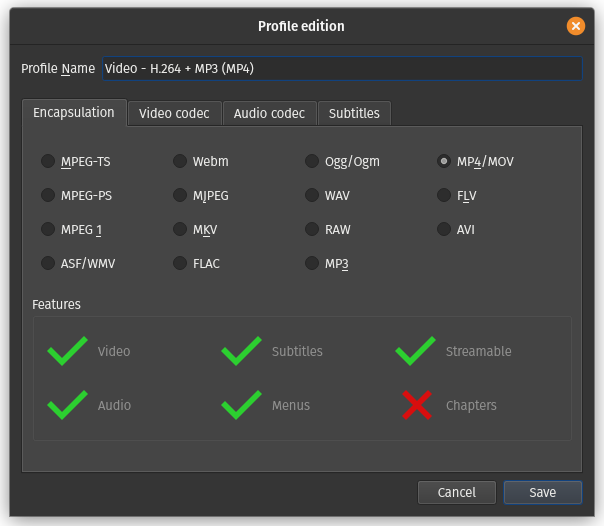
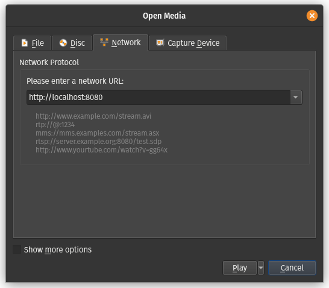
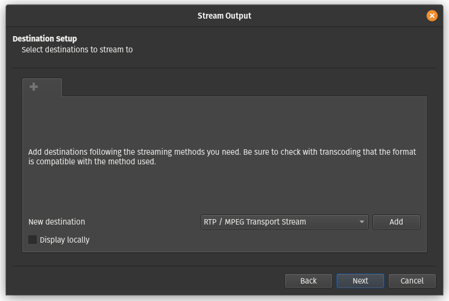
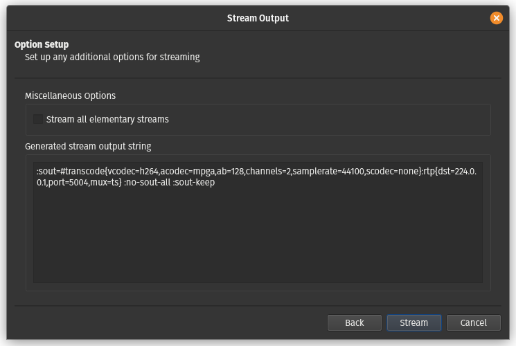

# 8. Vaja: Pretakanje video vsebine preko omrežja

## Navodila

0. Uporabite omrežje in navidezne računalnike iz prejšnjih vaj. 
1. Varno prenesi poljubni video posnetek s spletne platforme YouTube.
2. Uporabi program VLC za pretakanje video vsebine preko protokola HTTP.
3. Uporabi program VLC za pretakanje video vsebine preko naslova za razpošiljanje.

## Dodatne informacije

[YouTube](https://en.wikipedia.org/wiki/YouTube) je spletna platforma za deljenje video vsebin in služi kot tudi socialno omrežje.

[youtube-dl](https://github.com/ytdl-org/youtube-dl/) izvirni program za prenašanje video vsebine s spletne platforme YouTube.

[yt-dlp](https://github.com/yt-dlp/yt-dlp) je program, ki izboljša in razširi `youtube-dl`.

[VLC](https://www.videolan.org/vlc/) program za predvajanje audio in video datotek ter pretočnih protokolov.

[Hypertext Transfer Protocol - HTTP](https://en.wikipedia.org/wiki/Hypertext_Transfer_Protocol) protokol na aplikacijskih plasti za deljenje podatkov na spletu. Prvotno je bil namenjen objavljanju in prejemanju strani v [HyperText Markup Language - HTML](https://en.wikipedia.org/wiki/HTML) formatu.

[Uniform Resource Locator - URL](https://en.wikipedia.org/wiki/URL) predstavlja referenco spletni vir, ki določi njegovo lokacijo in način za njegovo pridobitev.

[Real-time Transport Protocol](https://en.wikipedia.org/wiki/Real-time_Transport_Protocol) je omrežni protokol za prenašanje audio in video vsebine preko IP omrežja.

[Real Time Streaming Protocol](https://en.wikipedia.org/wiki/Real_Time_Streaming_Protocol) je omrežni protokol na aplikacijski plasti, ki upravlja s prenosom multi-medijskih vsebin preko primernega protokola na transportni plasti.

[Razpošiljanje (angl. Multicast)](https://en.wikipedia.org/wiki/Multicast) je način komunikacije, ki omogoča pošiljanje podatkov skupni omrežnih računalnikov hkrati.

IP naslovi določeni za razpošiljanje:

| Omrežni blok   | Interval                      | Št. naslovov |
|----------------|-------------------------------|--------------|
| 224.0.0.0/4    | 224.0.0.0 - 239.255.255.255   | 268435456    |

## Podrobna navodila

### 1. Naloga

Namestimo program `yt-dlp` za prenos video vsebine s spletne platforme [YouTube](https://www.youtube.com/) preko ukaza `curl`.

    apt install curl

    sudo curl -L https://github.com/yt-dlp/yt-dlp/releases/latest/download/yt-dlp -o /usr/local/bin/yt-dlp
    
    sudo chmod a+rx /usr/local/bin/yt-dlp 

Sedaj še ponovno zaženemo okno terminala. Ko želimo prenesti video, lahko pred tem preverimo kateri formati so na voljo za prenos.

    yt-dlp -F https://www.youtube.com/watch?v=aEvP2tqaZD4

    [youtube] aEvP2tqaZD4: Downloading webpage
    [youtube] aEvP2tqaZD4: Downloading android player API JSON
    [info] Available formats for aEvP2tqaZD4:
    ID  EXT   RESOLUTION FPS CH │  FILESIZE   TBR PROTO │ VCODEC        VBR ACODEC      ABR ASR MORE INFO
    ─────────────────────────────────────────────────────────────────────────────────────────────────────────────
    sb2 mhtml 48x27        1    │                 mhtml │ images                                storyboard
    sb1 mhtml 80x45        1    │                 mhtml │ images                                storyboard
    sb0 mhtml 160x90       1    │                 mhtml │ images                                storyboard
    139 m4a   audio only      2 │   1.10MiB   49k https │ audio only        mp4a.40.5   49k 22k low, m4a_dash
    249 webm  audio only      2 │   1.07MiB   48k https │ audio only        opus        48k 48k low, webm_dash
    250 webm  audio only      2 │   1.42MiB   63k https │ audio only        opus        63k 48k low, webm_dash
    140 m4a   audio only      2 │   2.91MiB  130k https │ audio only        mp4a.40.2  130k 44k medium, m4a_dash
    251 webm  audio only      2 │   2.82MiB  126k https │ audio only        opus       126k 48k medium, webm_dash
    17  3gp   176x144      6  1 │   1.74MiB   77k https │ mp4v.20.3     77k mp4a.40.2    0k 22k 144p
    160 mp4   256x144     25    │   1.56MiB   69k https │ avc1.4d400c   69k video only          144p, mp4_dash
    278 webm  256x144     25    │   1.91MiB   85k https │ vp9           85k video only          144p, webm_dash
    133 mp4   426x240     25    │   3.16MiB  141k https │ avc1.4d4015  141k video only          240p, mp4_dash
    242 webm  426x240     25    │   3.80MiB  169k https │ vp9          169k video only          240p, webm_dash
    134 mp4   640x360     25    │   8.59MiB  382k https │ avc1.4d401e  382k video only          360p, mp4_dash
    18  mp4   640x360     25  2 │ ~11.79MiB  511k https │ avc1.42001E  511k mp4a.40.2    0k 44k 360p
    243 webm  640x360     25    │   7.06MiB  314k https │ vp9          314k video only          360p, webm_dash
    135 mp4   854x480     25    │  16.80MiB  747k https │ avc1.4d401e  747k video only          480p, mp4_dash
    244 webm  854x480     25    │  12.68MiB  564k https │ vp9          564k video only          480p, webm_dash
    22  mp4   1280x720    25  2 │ ~35.90MiB 1556k https │ avc1.64001F 1556k mp4a.40.2    0k 44k 720p
    136 mp4   1280x720    25    │  32.09MiB 1427k https │ avc1.4d401f 1427k video only          720p, mp4_dash
    247 webm  1280x720    25    │  25.70MiB 1143k https │ vp9         1143k video only          720p, webm_dash
    137 mp4   1920x1080   25    │  56.80MiB 2526k https │ avc1.640028 2526k video only          1080p, mp4_dash
    248 webm  1920x1080   25    │  45.59MiB 2028k https │ vp9         2028k video only          1080p, webm_dash

Nato se odločimo, na primer za možnost `22` in prenesemo video na lokalni disk.

    yt-dlp -f 22 https://www.youtube.com/watch?v=aEvP2tqaZD4

    [youtube] aEvP2tqaZD4: Downloading webpage
    [youtube] aEvP2tqaZD4: Downloading android player API JSON
    [info] aEvP2tqaZD4: Downloading 1 format(s): 22
    [download] Destination: Slovenian Impressions. Feel pure LOVE. [aEvP2tqaZD4].mp4
    [download] 100% of   34.99MiB in 00:00:04 at 7.70MiB/s

### 2. Naloga

Namestimo program `VLC` za predvajanje in pretakanje video in audio vsebin.

    apt install vlc

Pretakanje v programu `VLC` lahko zaženemo preko grafičnega čarovnika, ki ga zaženemo preko menija `Media\Stream ...`. Pod zavihkom `File` s pritiskom na gumb `Add` izberemo datoteko, ki jo želimo pretočiti in nato nadaljujemo s pritiskom na gumb `Stream`. 

V naslednjem koraku preverimo vir za pretakanje, tako da je v vnosnem polju `Source:` pot do datoteke, ki jo želimo pretakati in v vnosnem polju `Type:` določen tip `file` ter nato pritisnemo gumb `Next`. 

Sedaj izberemo protokol za pretakanje, na primer protokol `HTTP` v spustnem meniju `New destination` in pritisnem na gumb `Add`.  

V naslednjem koraku izberemo omrežna vrata za izbran protokol, tako da v spustnem meniju `Port` vnesemo vrata `8080` in vnosnem polju `Path` navedemo pot oz. URL na katerem se bo nahajal naš pretok, na primer `/`. Pritisnemo gumb `Next` za nadaljevanje.

Naslednji korak nam omogoča prekodiranje audio-video toka z izbiro možnosti `Activate Transcoding` in nato v spustnem meniju `Profile` lahko izberemo želeno kvaliteto iz v naprej definiranih profilov ali pa s klikom na gumb s ključek, ustvarimo naš poljuben profil. Kliknemo na gumb `Next` za nadaljevanje.

Pri ustvarjanju poljubnega profila za prekodiranje lahko izbiramo med poljubnimi podprtimi protokoli, ki so razvrščeni po njihovi vlogi v štiri zavihke: enkapsulacija `Encapsulation`,  video kodek `Video codec`, audio kodek `Audio codec` in podnapisi `Subtitles`. Vnesemo še ime našega profila v vnosno polje `Profile name` in ga z klikom na gumb `Save` shranimo ter ga lahko sedaj izberemo v spustnem meniju `Profile`.

V zadnjem oknu dobimo nastavitveni izpis v polju `Generated stream output string`, če bi želeli pognati naš trenutni pretok iz ukazne lupine z ukazom `vlc`. Pritisnemo na gumb `Stream` za pričetek pretoka.

Delovanje pretakanja preizkusimo, tako da odpremo še eno instanco predvajalnika `VLC` in odpremo pretok, tako da gremo v meni `Media\Open Network Stream ...`, v polju `Please enter a network URL:` podamo URL do našega toka, na primer `http://localhost:8080` in nato pritisnemo na gumb `Play`, da začnemo predvajanje toka. Preizkusite odpreti tudi pretok na drugem navideznem računalniku tako da odprete predvajalnik `VLC` in odprete pretok na URL-ju `http://10.0.0.1:8080`.

### 3. Naloga

Pretakanje v programu `VLC` lahko zaženemo preko grafičnega čarovnika, ki ga zaženemo preko menija `Media\Stream ...`. Pod zavihkom `File` s pritiskom na gumb `Add` izberemo datoteko, ki jo želimo pretočiti in nato nadaljujemo s pritiskom na gumb `Stream`. 

V naslednjem koraku preverimo vir za pretakanje, tako da je v vnosnem polju `Source:` pot do datoteke, ki jo želimo pretakati in v vnosnem polju `Type:` določen tip `file` ter nato pritisnemo gumb `Next`. 

Sedaj izberemo protokol za pretakanje, na primer protokol `RTP / MPEG Transport Stream` v spustnem meniju `New destination` in pritisnem na gumb `Add`.  

V naslednjem koraku izberemo omrežna vrata za izbran protokol, tako da v vnosnem polju `Address` vnesemo naslov za razpošiljanje na katerem bo pretok dostopen, v spustnem meniju `Port` vnesemo vrata `5004` in vnosnem polju `Stream name` navedemo ime našega pretoka, na primer ` `. Pritisnemo gumb `Next` za nadaljevanje.

Naslednji korak nam omogoča prekodiranje audio-video toka z izbiro možnosti `Activate Transcoding` in nato v spustnem meniju `Profile` lahko izberemo želeno kvaliteto iz v naprej definiranih profilov ali pa s klikom na gumb s ključek, ustvarimo naš poljuben profil. Kliknemo na gumb `Next` za nadaljevanje.

Pri ustvarjanju poljubnega profila za prekodiranje lahko izbiramo med poljubnimi podprtimi protokoli, ki so razvrščeni po njihovi vlogi v štiri zavihke: enkapsulacija `Encapsulation`,  video kodek `Video codec`, audio kodek `Audio codec` in podnapisi `Subtitles`. Vnesemo še ime našega profila v vnosno polje `Profile name` in ga z klikom na gumb `Save` shranimo ter ga lahko sedaj izberemo v spustnem meniju `Profile`.

V zadnjem oknu dobimo nastavitveni izpis v polju `Generated stream output string`, če bi želeli pognati naš trenutni pretok iz ukazne lupine z ukazom `vlc`. Pritisnemo na gumb `Stream` za pričetek pretoka.

Delovanje pretakanja preizkusimo, tako da odpremo še eno instanco predvajalnika `VLC` in odpremo pretok, tako da gremo v meni `Media\Open Network Stream ...`, v polju `Please enter a network URL:` podamo URL do našega toka, na primer `rtp://224.0.0.1:5004` in nato pritisnemo na gumb `Play`, da začnemo predvajanje toka. Preizkusite odpreti tudi pretok na drugem navideznem računalniku tako da odprete predvajalnik `VLC` in odprete pretok na URL-ju `rtp://224.0.0.1:5004`. Če pretok ne deluje, potem omrežje ne podpira razpošiljanje, to lahko odpravite, tako da obe omrežni kartici v obeh navideznih računalnikih, ki sta trenutno nastavljeni na notranje omrežje `Internal Network` nastavite na omrežje NAT `NAT Network`.

